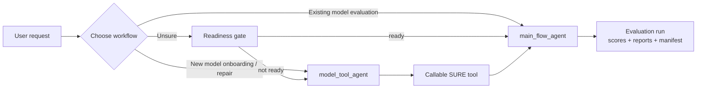
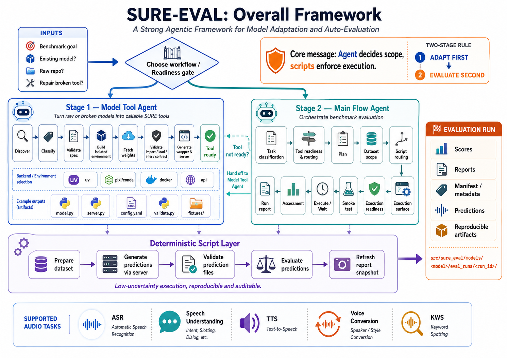

<div align="center">


# SURE-EVAL

**S**ystematic **U**nified **R**obust **E**valuation Framework for Audio Processing

[](./README.md)
[](./README_ZH.md)
[](./docs/SURE-EVAL_User_Manual.md)
[](./docs/SURE-EVAL_User_Manual.html)
[](./docs/SURE-EVAL_User_Manual.pdf)
[](https://www.python.org/downloads/)
[](https://opensource.org/licenses/MIT)

</div>

---

## 📖 User Manual (Recommended)

> New to SURE-EVAL? Start with the complete user manual:
>
> - **[📄 Markdown Manual](./docs/SURE-EVAL_User_Manual.md)** (read in repo)
> - **[🌐 HTML Manual](./docs/SURE-EVAL_User_Manual.html)** (browser-friendly)
> - **[📥 PDF Manual](./docs/SURE-EVAL_User_Manual.pdf)** (print / offline)
>
> The manual uses **Qwen3-ASR** as a running example and covers installation, data preparation, model onboarding, evaluation execution, and Agent Flow in detail.

---

## 📋 Overview

SURE-EVAL is an **automated evaluation framework** for audio tools and models, built around a simple principle:

> **🎯 Agent decides scope, scripts enforce execution.**

**Who this is for**: audio ML researchers and engineers who want reproducible, auditable benchmark evaluation without hand-rolling a new pipeline for every model.

### Three-Layer Architecture



| Layer | Role | Key docs |
|-------|------|----------|
| 🤖 **Main Flow Agent** | Decides what should be run | [`docs/agents/main_flow_agent/README.md`](docs/agents/main_flow_agent/README.md) |
| 🔧 **Model Tool Agent** | Makes models callable in reproducible ways | [`docs/agents/model_tool_agent/README.md`](docs/agents/model_tool_agent/README.md) |
| 📜 **Deterministic Script Layer** | Prepares, validates, scores, records | [`scripts/`](scripts/) |

### Overall Framework



---

## ✨ What SURE-EVAL Solves

| Goal | How |
|------|-----|
| **🚀 Onboard a new audio model** | Turn raw repositories into stable local tools |
| **📊 Run controlled evaluations** | Select datasets → Generate predictions → Validate → Score → Record |

> 💡 **Key Insight**: Model integration is high-uncertainty, but evaluation execution should be low-uncertainty. SURE-EVAL separates these concerns.

---

## 🏗️ Architecture

### 🤖 1. Main Flow Agent

**Role**: Orchestration layer

**Responsibilities**:
- Understanding user goals
- Task classification
- Tool readiness verification
- Dataset scope selection
- Script routing
- Outcome assessment

📖 **Documentation**:
- [Agent README](docs/agents/main_flow_agent/README.md)
- [Agent Guide](docs/agents/main_flow_agent/AGENTS.md)
- [Workflow Gallery](docs/agents/workflow_gallery.md)

---

### 🔧 2. Model Tool Agent

**Location**: [`docs/agents/model_tool_agent/`](docs/agents/model_tool_agent/)

**Responsibilities**:
- Backend selection
- Environment isolation
- Import / Load / Infer / Contract validation
- Wrapper generation
- Artifact management

📖 **Documentation**:
- [Model Tool Agent README](docs/agents/model_tool_agent/README.md)
- [Model Tool Agent Guide](docs/agents/model_tool_agent/AGENTS.md)
- [Workflow Gallery](docs/agents/workflow_gallery.md)

---

### 📜 3. Deterministic Script Layer

**Core Scripts**:

| Script | Purpose |
|--------|---------|
| `prepare_sure_dataset.py` | Canonical dataset preparation |
| `materialize_predictions_template.py` | Prediction template generation |
| `validate_prediction_files.py` | Prediction validation |
| `evaluate_predictions.py` | Metric & RPS computation |
| `refresh_report_snapshot.py` | Result recording & reports |

**Deterministic Metric CLI**:

```bash
sure-eval metric describe asr --language zh --metric cer --output /tmp/asr_pipeline.json --json
sure-eval metric run --pipeline /tmp/asr_pipeline.json --ref-file ref.txt --hyp-file hyp.txt --output-dir /tmp/sure_eval/asr_eval --json
```

The CLI calls `sure_eval.evaluation.scripts.run_task(...)`; route selection,
executor loading, pipeline-id validation, and output writing stay in the script
layer. It reports node-local environment hints but does not validate uv or
node dependencies.

---

## 🚀 Quick Start Guide

### 📍 Which Path Should I Use?

```
Start Here
    ↓
┌────────────────────────────────────────────────────────────┐
│ Do you have a model under src/sure_eval/models/<model>?   │
└────────────────────────────────────────────────────────────┘
    │
    ├── ❌ No → Use Model Tool Agent
    │         → Build model-local server first
    │         → Then use Main Flow Agent
    │
    └── ✅ Yes → Check config.yaml for server/tool path
                │
                ├── ❌ No server path
                │   → Use Model Tool Agent
                │
                └── ✅ Server path exists
                    → Run TOOL_READINESS_AND_ROUTING_UNIT
                        │
                        ├── 🟢 server_ready
                        │   → Continue to evaluation
                        │
                        ├── 🟡 server_declared_but_unverified
                        │   → Run smoke test first
                        │
                        └── 🔴 tool_broken_needs_repair
                            → Hand off to Model Tool Agent
```

---

### 🛠️ Path A: Onboard a New Model

**Use when**: Model is not yet in `src/sure_eval/models/`

**Steps**:
1. Go to [Model Tool Agent README](docs/agents/model_tool_agent/README.md)
2. Use the model tool agent prompt template
3. Let the workflow produce a callable model
4. Switch to Main Flow Agent for evaluation

---

### 🎯 Path B: Evaluate an Existing Model

**Use when**: Model already has a directory in `src/sure_eval/models/`

**Steps**:
1. Use prompt from [Agent README](docs/agents/main_flow_agent/README.md)
2. Let agent execute:
   - `TASK_CLASSIFICATION_UNIT`
   - `TOOL_READINESS_AND_ROUTING_UNIT`
   - `PLAN_UNIT`
   - `DATASET_SCOPE_UNIT`
   - `SCRIPT_ROUTING_UNIT`
   - `EXECUTION_SURFACE_UNIT`
   - `EXECUTION_READINESS_UNIT`
   - `SMOKE_TEST_UNIT`
3. Continue to prediction generation and scoring

Recommended artifact root:

- `src/sure_eval/models/<model>/eval_runs/<run_id>/`

Layout contract:

- [docs/agents/main_flow_agent/contracts/eval_run_layout.md](docs/agents/main_flow_agent/contracts/eval_run_layout.md)

---

## ⚡ Installation

### Prerequisites

- **Python**: 3.10+ for the main environment; some models require 3.11.
- **System packages**: `ffmpeg`, `libsndfile1` (for audio I/O).
- **Storage**: at least 20 GB for model weights and datasets.
- **GPU**: optional but recommended; Qwen3-ASR can run on CPU, slowly.
- **Network**: ModelScope access from mainland China; HuggingFace is often blocked.

### Quick install with `uv`

```bash
# Clone repository
git clone https://github.com/PigeonDan1/sure.git
cd sure

# Create and activate main environment (Python 3.12 recommended)
uv venv --python 3.12
source .venv/bin/activate

# Install the framework
uv pip install -e .

# Verify
python -m sure_eval.models.registry
```

Each model also has its own isolated environment under `src/sure_eval/models/<model>/.venv/`. See the model's `setup.sh` for details.

Dataset payloads are local-only. The top-level `data/` directory is reserved for local mounts, symlinks, caches, and smoke data; tracked dataset registry updates should live under `config/` or docs instead.

> 💡 **Tip**: The minimal prompts in the agent READMEs are copy-paste templates for a Chinese-speaking agent runtime. You can translate the instructions to English if your agent runtime prefers it.

---

## 📊 Deterministic Evaluation Pipeline

Execute evaluation without agents (requires an already-onboarded model such as `asr_qwen3`):

```bash
# 1️⃣ Prepare datasets
python scripts/prepare_sure_dataset.py \
  --dataset aishell1

# 2️⃣ Generate predictions via the model's MCP server
python scripts/generate_predictions_via_server.py \
  --model-dir src/sure_eval/models/asr_qwen3 \
  --dataset aishell1 \
  --run-dir /tmp/eval_run \
  --tool-name asr_transcribe \
  --language auto \
  --resume

# 3️⃣ Validate predictions
python scripts/validate_prediction_files.py \
  --dataset aishell1 \
  --pred-dir /tmp/eval_run/predictions \
  --require-nonempty

# 4️⃣ Evaluate and record
python scripts/evaluate_predictions.py \
  --dataset aishell1 \
  --pred-dir /tmp/eval_run/predictions \
  --tool-name asr_qwen3 \
  --record \
  --output /tmp/eval_payload.json

# 5️⃣ Refresh report snapshot
python scripts/refresh_report_snapshot.py \
  --markdown reports/asr_qwen3.md \
  --json reports/asr_qwen3_summary.json
```

---

## 🔄 Main Flow Execution

### Flow Diagram

```
TASK_CLASSIFICATION_UNIT
        ↓
TOOL_READINESS_AND_ROUTING_UNIT
        ↓
      PLAN_UNIT
        ↓
   DATASET_SCOPE_UNIT
        ↓
   SCRIPT_ROUTING_UNIT
        ↓
EXECUTION_SURFACE_UNIT
        ↓
EXECUTION_READINESS_UNIT
        ↓
   EXECUTE / WAIT
        ↓
   ASSESSMENT_UNIT
        ↓
   RUN_REPORT_UNIT
```

> ⚠️ **Critical Rule**: Never skip tool readiness routing!

If a model declares a server path:
1. Prefer server-first smoke test
2. Confirm `server_ready` status
3. Only then proceed to evaluation

### Two-Stage Rule

> 🚦 **Adapt first, evaluate second.**
>
> SURE-EVAL treats **model onboarding** and **evaluation** as two distinct stages:
> 1. **Stage 1 — Model Tool Agent**: turn a raw model into a callable SURE tool.
> 2. **Stage 2 — Main Flow Agent**: run benchmark evaluation on that tool.
>
> If the main flow sees `not_tool_ready` or `tool_broken_needs_repair`, stop evaluation routing and hand off to the Model Tool Agent. Do not improvise evaluation-time fixes.
>
> For new models, provide onboarding-oriented inputs early: upstream repo, checkpoint source, expected task/IO contract, and environment hints.

📖 **Example**: [Qwen3 ASR Case Study](docs/agents/main_flow_agent/contracts/main_agent_qwen3_asr_case.md)

Prediction generation should follow a hard contract rather than an implicit
"wait until files appear" step:

- [docs/agents/main_flow_agent/contracts/prediction_generation_contract.md](docs/agents/main_flow_agent/contracts/prediction_generation_contract.md)

For human-operated background runs, prefer a single-model single-dataset shell:

- [docs/agents/main_flow_agent/contracts/single_model_single_dataset_shell.md](docs/agents/main_flow_agent/contracts/single_model_single_dataset_shell.md)

Before handing that shell to a user, the main flow should first materialize the
execution surface and then run a bounded execution-readiness validation:

- [docs/agents/main_flow_agent/contracts/main_agent_execution_surface_unit.md](docs/agents/main_flow_agent/contracts/main_agent_execution_surface_unit.md)
- [docs/agents/main_flow_agent/contracts/main_agent_execution_readiness_unit.md](docs/agents/main_flow_agent/contracts/main_agent_execution_readiness_unit.md)

---

## 📝 Example: Evaluate with Main Flow Agent

Use the prompt template from [Agent README](docs/agents/main_flow_agent/README.md), then provide:

```yaml
MAIN_FLOW_INPUT:
  user_goal: evaluate_existing_model

  target:
    model_name: asr_qwen3
    model_dir: src/sure_eval/models/asr_qwen3
    tool_workflow_ready: true

  constraints:
    allow_tool_workflow: true
    allowed_tasks: [ASR]
    allowed_datasets: null
    blocked_datasets: []
    dry_run: false

  evidence:
    readme_path: src/sure_eval/models/asr_qwen3/README.md
    config_path: src/sure_eval/models/asr_qwen3/config.yaml
    artifacts_dir: src/sure_eval/models/asr_qwen3/artifacts
    model_spec_path: src/sure_eval/models/asr_qwen3/model.spec.yaml

  runtime_context:
    available_scripts:
      - scripts/prepare_sure_dataset.py
      - scripts/materialize_predictions_template.py
      - scripts/validate_prediction_files.py
      - scripts/evaluate_predictions.py
    output_dir: src/sure_eval/models/asr_qwen3/eval_runs/main_agent_asr_qwen3_001
```

### Structured Outputs

- `task_classification.json`
- `tool_readiness_routing.json`
- `main_agent_plan.json`
- `dataset_decision.json`
- `script_routing.json`
- `execution_surface.json`
- `execution_readiness_report.json`
- `assessment_report.json`
- `main_agent_run_report.json`
- `model_eval_manifest.json`

---

## 📁 Project Structure

```
sure-eval/
├── data/                   # 📂 Local dataset mounts and caches; ignored by Git
├── src/sure_eval/
│   ├── core/               # ⚙️ Core utilities
│   ├── datasets/           # 📂 Dataset management
│   ├── evaluation/         # 📊 Metrics and RPS
│   ├── models/             # 🔧 Model registry & onboarded models
│   └── reports/            # 📈 Reporting and baselines
├── scripts/                # 📜 Deterministic evaluation scripts
├── config/                 # ⚙️ Configuration files
├── fixtures/tasks/         # 🧪 Shared task fixtures
└── docs/agents/            # 📚 Agent-scoped harness docs and templates
    ├── main_flow_agent/
    └── model_tool_agent/
```

---

## 🎯 Supported Tasks

| Task | Description |
|------|-------------|
| **ASR** | Automatic Speech Recognition |
| **S2TT** | Speech-to-Text Translation |
| **SD** | Speaker Diarization |
| **SA-ASR** | Speaker-Aware ASR |
| **SER** | Speech Emotion Recognition |
| **Speech Enhancement** | Noise suppression, enhancement |
| **Music IR** | Music information retrieval |

---

## ❓ FAQ

**Q: What do `server_declared_but_unverified` and `tool_broken_needs_repair` mean?**

| Status | Meaning | Next step |
|---|---|---|
| `server_ready` | The model server passed the smoke test | Continue to evaluation |
| `server_declared_but_unverified` | `config.yaml` declares a server, but it hasn't been smoke-tested | Run `scripts/generate_predictions_via_server.py --max-samples 1` manually |
| `not_tool_ready` | The model directory is missing required files | Start with the [Model Tool Agent](docs/agents/model_tool_agent/README.md) |
| `tool_broken_needs_repair` | The environment or wrapper is broken | Hand off to the Model Tool Agent; do not continue evaluation |

**Q: Where are evaluation artifacts stored?**

Each run writes structured outputs under `src/sure_eval/models/<model>/eval_runs/<run_id>/`. See the [eval run layout contract](docs/agents/main_flow_agent/contracts/eval_run_layout.md).

**Q: Can I run evaluation without agents?**

Yes. Use the deterministic script pipeline shown in [📊 Deterministic Evaluation Pipeline](#-deterministic-evaluation-pipeline).

---

## 📚 Documentation Map

| Document | Purpose |
|----------|---------|
| [User Manual](./docs/SURE-EVAL_User_Manual.md) | Complete Chinese user manual (also available as [HTML](./docs/SURE-EVAL_User_Manual.html) / [PDF](./docs/SURE-EVAL_User_Manual.pdf)) |
| [Workflow Gallery](docs/agents/workflow_gallery.md) | Visual overview of both agent workflows |
| [Main Flow Agent](docs/agents/main_flow_agent/README.md) | Agent system prompt & examples |
| [Agent Routing](docs/agents/main_flow_agent/AGENTS.md) | Main flow routing guide |
| [Model Tool Agent](docs/agents/model_tool_agent/README.md) | Model integration workflow |
| [Onboarded Models](src/sure_eval/models/README.md) | Clean model directory set and local artifact policy |
| [Architecture](docs/agents/main_flow_agent/contracts/main_flow_architecture.md) | System architecture details |
| [Evaluation Run Layout](docs/agents/main_flow_agent/contracts/eval_run_layout.md) | Model-local artifact layout per run |
| [Prediction Generation Contract](docs/agents/main_flow_agent/contracts/prediction_generation_contract.md) | Hard contract for `wait_for_predictions` |
| [Single Model Single Dataset Shell](docs/agents/main_flow_agent/contracts/single_model_single_dataset_shell.md) | One-command execution contract for human operators |
| [Execution Readiness Unit](docs/agents/main_flow_agent/contracts/main_agent_execution_readiness_unit.md) | Preflight shell validation before background runs |
| [Model Eval Manifest](docs/agents/main_flow_agent/contracts/model_eval_manifest.md) | One-file index for a model evaluation run |
| [Qwen3 Case Study](docs/agents/main_flow_agent/contracts/main_agent_qwen3_asr_case.md) | Real replay case |

---

## 📄 License

MIT License. See [LICENSE](LICENSE).
