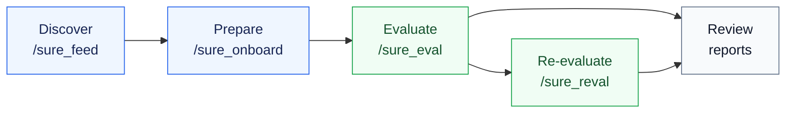

# SURE Harness

<p align="center">
  <a href="https://sure-eval.com/harness"></a>
  <a href="./docs/harness_user_guide.md"></a>
  <a href="./docs/evaluation_engine.md"></a>
  <a href="./README_ZH.md"></a>
</p>

> TUI-agent control plane for speech and audio model evaluation.

SURE Harness helps Pi/Codex-style TUI agents evaluate audio models from model
discovery to audited reports. It turns onboarding, VC/local execution, metric
routing, and prediction re-evaluation into explicit slash-command workflows.

## Why SURE Harness

| User need | Product answer |
| --- | --- |
| Agents need a route through a complex evaluation repo. | Slash commands expose bounded, artifact-gated workflows. |
| Evaluation results must be reproducible and reviewable. | Every run writes reports, manifests, route plans, and validation payloads. |
| Metric routes evolve outside the harness. | The harness reads the `sure-evaluation` submodule at runtime. |
| Existing predictions should be reusable. | `/sure_reval` recomputes metrics without rerunning model inference. |

## Workflow



## What You Can Do

| Block | Command | Prepare | Expect |
| --- | --- | --- | --- |
| Model discovery | `/sure_feed` | Model URL, provider query, or curated source. | `model_input.yaml` and discovery report. |
| Model preparation | `/sure_onboard` | Feed handoff or explicit `model_input_path`. | Runnable wrapper, model spec, fixture, and `verdict.json`. |
| Full evaluation | `/sure_eval` | Onboarded model, dataset, metric, execution target. | Predictions, validation payload, route plan, metric reports. |
| Prediction re-evaluation | `/sure_reval` | Existing `results_dir`, run dir, or `predictions/`. | Fresh evaluation-only run and `reval_run_report.json`. |
| Route-backed metrics | `sure-evaluation` | Engine submodule plus benchmark JSONL files. | Current metric capabilities, exact `pipeline_id` execution. |

## Quick Start

Prerequisites: Node.js >= 22.19.0, git, and Python >= 3.10 with PyYAML
(`pip install -r requirements.txt`). The evaluation engine used by
`/sure_eval` needs its own install once:
`pip install -e sure/external/sure-evaluation`.

```bash
git clone --recurse-submodules --depth 1 --single-branch --branch harness-tui-agent https://github.com/PigeonDan1/sure.git sure-harness
cd sure-harness
npm install --ignore-scripts
pip install -r requirements.txt
```

If the repository was cloned without submodules:

```bash
git submodule update --init --recursive
```

Prepare benchmark data. Only `/sure_eval` and `/sure_reval` need it —
feed and onboard run without it, so you can defer this step. The data
lives on ModelScope (`SUREBenchmark/SURE_Test_csv`, 14 annotation CSVs,
~34 MB; `SUREBenchmark/SURE_Test_Suites`, 12 audio archives, 52.5 GB in
total; Apache-2.0, no login):

```bash
pip install -e "sure/external/sure-evaluation[download]"
python sure/external/sure-evaluation/scripts/download_sure_data.py --csv
modelscope download --dataset SUREBenchmark/SURE_Test_Suites aishell-1_test.tar.gz --local_dir data/datasets/sure_benchmark/SURE_Test_Suites
cd data/datasets/sure_benchmark/SURE_Test_Suites && mkdir -p aishell-1_test && tar -xzf aishell-1_test.tar.gz -C aishell-1_test && cd -
python sure/external/sure-evaluation/scripts/convert_sure_to_jsonl.py --csv-dir data/datasets/sure_benchmark/SURE_Test_csv --output-dir data/datasets/sure_benchmark/jsonl
npm run sure:doctor
```

This example fetches one archive (AISHELL-1, 866 MB) — download the
archives for the datasets you plan to evaluate the same way, or fetch
everything at once with `download_sure_data.py --suites` (52.5 GB, and
it prints no progress while it runs). Converted files are named after
the CSVs, for example `aishell1-test_ASR.jsonl`; pass those names minus
`.jsonl` as `datasets=`. If you already have the JSONL tree somewhere,
link it instead:
`ln -s /path/to/sure_benchmark/jsonl data/datasets/sure_benchmark/jsonl`.
Archive sizes, extraction checks, and naming details live in the
[user guide](./docs/harness_user_guide.md).

Start the TUI:

```bash
./pi-test.sh --approve
```

You do not need an API key to start, and `--model` is optional. Inside
the TUI, run `/sure_init` first: it picks a provider, takes an API key
or sets up an OpenAI-compatible gateway interactively, and switches the
session to the chosen model. Credentials land in `~/.pi/agent/auth.json`
and custom gateways in `~/.pi/agent/models.json` — `/sure_init` manages
both files, so you rarely edit them by hand
(`packages/coding-agent/docs/providers.md` lists the env-var
alternative per provider). If you already exported a key,
`./pi-test.sh --provider <p> --model <m> --thinking high --approve`
still works. `--approve` trusts this project's configuration for the
session; without it the TUI asks on first start.

Run the main path:

```text
/sure_init
/sure_feed source=modelscope query="english asr" max_models=20
/sure_onboard model=<model>
/sure_eval model=<model_name> datasets=aishell1-test_ASR metrics=cer max_samples=5 execution=local
```

Pair metrics with datasets: `aishell1-test_ASR` is Chinese, so it takes
`cer`; `wer` only has English routes, so pair it with an English set
such as `librispeech_test-clean_ASR`.

Recompute metrics from existing predictions:

```text
/sure_reval source=<results_or_run_dir> datasets=aishell1 max_samples=5 pipeline_id=<exact_pipeline_id>
```

Dataset short names such as `aishell1` are accepted when exactly one
matching prediction file exists, for example `aishell1-test_ASR.txt`.

## Cluster Execution

`execution=vc` submits real jobs through the `vc` CLI — a cluster
job-submission system, unrelated to the voice-conversion task. It
requires a working `vc` CLI (`which vc && vc info` must succeed) and
never falls back to local execution; use `execution=local` for
development and smoke runs. With `execution=vc`, add
`vc_partition=<partition>` to pick the cluster partition; when omitted
the harness selects one automatically. A partition name outside your
allowed set fails fast at input resolution and the error lists the
partitions you can use — but when the partition list itself cannot be
fetched (`vc info -u` failing or timing out), the early check is
skipped and a bad name only surfaces at `vc submit` time. Related
overrides: `vc_gpu`, `vc_mem`, `vc_cpu`, `vc_image`, `vc_job_name`.

## Inputs And Outputs

| Stage | Primary input | Main output | Ready signal |
| --- | --- | --- | --- |
| Discover | Model URL or query. | `sure/handoffs/<model>/model_input.yaml` | Task evidence and IO contract are present. |
| Prepare | `model=<handoff>` or `model_input_path=...` | `sure/models/<model>/verdict.json` | Import/load/infer/contract checks pass. |
| Evaluate | Model, datasets, metrics, execution target. | `main_agent_run_report.json` plus metric artifacts. | Predictions validate and route reports exist. |
| Re-evaluate | Previous results or predictions. | `reval_run_report.json` in a fresh tmp run. | `evaluation_only=true`; old metric artifacts are not reused. |

## Standard Artifacts

| Artifact | Produced by | What it proves |
| --- | --- | --- |
| `runtime_inventory.json` | `/sure_onboard` | Model-level runtime, Python/backend, weights manifest, and evidence links. |
| `prediction_generation_status.json` | `/sure_eval` | Actual inference server command, environment snapshot, explicit tool args, protocol resolution, and dataset generation status. |
| `protocol.yaml` | `/sure_eval` and `/sure_reval` | Inference protocol only: model, runtime, parameters, prediction reuse, and provenance. |
| `report_snapshot.md` | `/sure_eval` and `/sure_reval` | Human-readable evaluation scope, route, metric, and result snapshot. |
| `report.jsonl` | `/sure_eval` and `/sure_reval` | Machine-readable per dataset-metric results. |
| `source_inference_provenance.json` | `/sure_reval` | Source protocol/status/runtime links when predictions are reused. |

## Operational Guardrails

| Area | Behavior |
| --- | --- |
| Re-evaluation dataset names | `/sure_reval` accepts the same short dataset aliases as `/sure_eval` when the match is unique. |
| Agent repair loop | Hook diagnostics report accumulated type mismatches, retry-derived `gate_blocks`, and the real blocking reason. |
| Local verification | `npm run check` is non-mutating; use `npm run format` when you want Biome to rewrite files. |
| Credential-safe tests | `test.sh`, `pi-test.sh --no-env`, and `pi-test.ps1 --no-env` read `scripts/credential-env.txt` and hide `auth.json` temporarily. Add variable names there, never secret values. |

## Docs

| Need | Read |
| --- | --- |
| From zero to first run, command fields, output contracts. | [User guide](./docs/harness_user_guide.md) |
| Metric engine setup, datasets, route and `pipeline_id` selection. | [Evaluation engine](./docs/evaluation_engine.md) |
| Common setup, provider, dataset, and VC failures. | [Troubleshooting](./docs/troubleshooting.md) |
| Skill package layout, development checks, design boundaries. | [Development guide](./docs/development.md) |
| Chinese documentation. | [README_ZH](./README_ZH.md), [用户指南](./docs/harness_user_guide_zh.md) |
| Product demo. | [sure-eval.com/harness](https://sure-eval.com/harness) |

## Repository Hygiene

| Keep in repo | Keep out of repo |
| --- | --- |
| Harness code, skill packages, schemas, prompts. | API keys, provider tokens, auth files. |
| Small fixtures and tests. | Model weights, checkpoints, large datasets. |
| Documentation and examples. | Predictions, metric result dumps, `.sure/` runs, virtual environments. |

Expected local output paths such as `.sure/`, `sure/models/`,
`sure/handoffs/*/artifacts/`, and `sure/skills/sure_eval/results/` are ignored.
`sure/external/sure-evaluation` is tracked as a submodule gitlink, so the parent
repository records the verified engine commit without committing engine files.

## License

[MIT](./LICENSE)
