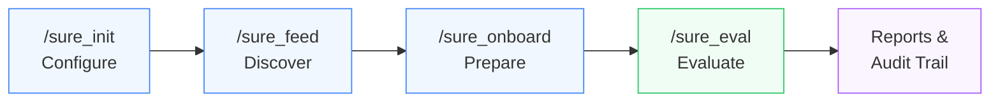
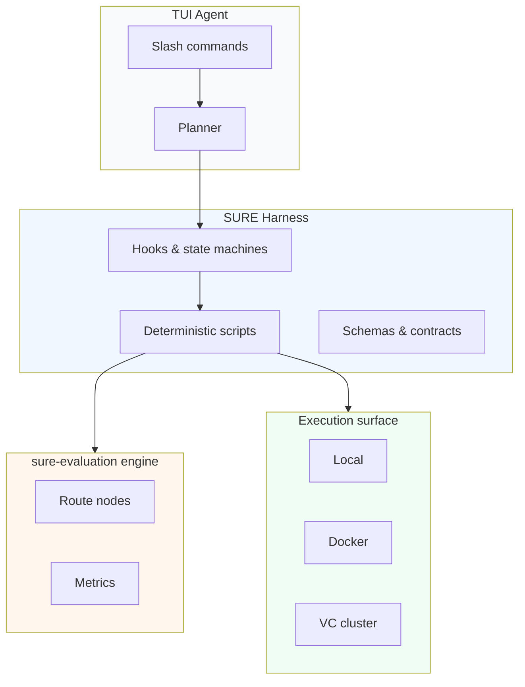

# SURE Harness

[English](./README.md) · [中文](./README_ZH.md) · [License](./LICENSE)

> Turn audio-model evaluation into agent-readable, artifact-gated workflows.

SURE Harness is the control plane for Pi/Codex-style TUI agents that discover
audio models, prepare them, run bounded validation, submit real evaluation jobs,
and leave an auditable trail.

A human states intent through slash commands. The agent plans and executes. The
harness keeps every run reproducible, inspectable, and safe to review.

---

## At a glance



## Product workflows

| Command | Stage | What it does | Key artifacts |
| --- | --- | --- | --- |
| `/sure_init` | Configure | One-time setup: agent/provider, auth location, skill discovery, backend checks. | Project config |
| `/sure_feed` | Discover | Find candidate models from ModelScope, HuggingFace, GitHub, or curated input; classify them into SURE task families. | `model_input.yaml`, `feed_report.json` |
| `/sure_onboard` | Prepare | Turn a model repo into a runnable local inference unit with wrapper, environment plan, fixture, package gate, and verdict. | `verdict.json`, wrapper files, model spec |
| `/sure_eval` | Evaluate | Evaluate an already-onboarded audio model through a deterministic SURE-EVAL route plan and a gated execution surface. | `main_agent_run_report.json`, route plan, metric reports |

## Architecture



## Core capabilities

| Capability | Responsibility |
| --- | --- |
| **Task routing** | Map model and dataset metadata to ASR, TTS, VC, KWS, S2TT, diarization, speech understanding, and related task families. |
| **Model input synthesis** | Convert discovery evidence into `MODEL_INPUT` YAML for onboarding. |
| **Fixture preparation** | Prepare small task-specific smoke fixtures without treating smoke data as benchmark evidence. |
| **Runtime planning** | Select local, Docker, or VC execution surfaces and record the decision. |
| **Execution gating** | Run smoke tests, block invalid fallbacks, and require terminal artifacts before a run can finish. |
| **Evaluation routing** | Read the external `sure-evaluation` engine, discover supported metrics, select route nodes, and verify node-local environments. |
| **VC submission** | Materialize a submit-ready entrypoint, submit with provenance, and record resource repairs such as queue memory limits. |
| **Artifact manifests** | Persist `run.json`, `events.jsonl`, final manifest, reports, metric payloads, and failure diagnostics. |

## Quick start

### 1. Clone and install

```bash
git clone --depth 1 --single-branch --branch harness-agent-eval-product-20260720 https://github.com/PigeonDan1/sure.git sure-harness
cd sure-harness
npm install --ignore-scripts
npm run sure:doctor
```

If HTTPS cloning stalls in a restricted network, use SSH after adding a GitHub
SSH key:

```bash
git clone --depth 1 --single-branch --branch harness-agent-eval-product-20260720 git@github.com:PigeonDan1/sure.git sure-harness
```

### 2. Launch the TUI

```bash
./pi-test.sh --provider openai --model <model-name> --thinking high --approve
```

### 3. Run the workflow

```text
/sure_init
/sure_feed source=modelscope query="english asr" max_models=20
/sure_onboard model=<model>
/sure_eval model=<model_name> datasets=<dataset_name> metrics=wer max_samples=5 execution=vc
```

`/sure_onboard model=<model>` reads `sure/handoffs/<model>/model_input.yaml` by
default. Use `model_input_path=...` only when the handoff lives somewhere else.

For a small ASR smoke path:

```text
/sure_feed https://huggingface.co/Qwen/Qwen3-ASR-0.6B-hf
/sure_onboard model=Qwen__Qwen3-ASR-0.6B-hf device=auto package=none
/sure_eval model=Qwen__Qwen3-ASR-0.6B-hf datasets=aishell1 metrics=cer max_samples=1 execution=local device=auto
```

For local development, use `execution=local`:

```text
/sure_eval model=<model_name> datasets=<dataset_name> metrics=wer max_samples=5 execution=local
```

> **Note:** When `execution=vc` is requested, the run must produce real VC
> submission evidence. The harness does not silently fall back to local
> execution.

## Evaluation engine

SURE Harness reads metric capabilities and route nodes from the standalone
`sure-evaluation` engine. Keep that checkout local and out of this repository's
Git history:

```bash
mkdir -p sure/external
git clone https://github.com/PigeonDan1/sure-evaluation.git sure/external/sure-evaluation
```

You can also point at a local engine explicitly:

```bash
export SURE_EVALUATION_HOME=/path/to/sure-evaluation
```

`/sure_eval` also needs SURE benchmark JSONL files. Either link them into the
default harness location:

```bash
mkdir -p data/datasets/sure_benchmark
ln -s /path/to/sure_benchmark/jsonl data/datasets/sure_benchmark/jsonl
npm run sure:doctor
```

or point the runtime at a dataset root that contains `sure_benchmark/jsonl`:

```bash
export SURE_EVAL_DATASETS_ROOT=/path/to/data/datasets
```

Typical evaluation routes:

| Task | Route |
| --- | --- |
| ASR zh CER | `normalization/wetext_norm -> scoring/wenet_cer` |
| TTS/VC zh CER | `frontend/funasr_loader_16k_mono -> transcription/paraformer_zh -> normalization/punctuation_strip_norm -> scoring/wenet_cer` |
| TTS en WER | `transcription/whisper_large_v3 -> normalization/whisper_norm -> scoring/wenet_wer` |

## Repository hygiene

| Keep in repo | Keep out of repo |
| --- | --- |
| Harness code, skill packages, schemas, prompts | API keys, provider tokens, auth files |
| Small fixtures and tests | Model weights, checkpoints, large datasets |
| | Generated predictions, metric result dumps |
| | `.sure/` run directories |
| | Local external-engine checkouts |
| | Model-local virtual environments or cache directories |

Runtime outputs are expected under ignored paths such as `.sure/`,
`sure/models/`, `sure/handoffs/*/artifacts/`, and
`sure/skills/sure_eval/results/`.

## Troubleshooting

### `Cannot find module 'typebox'`

SURE commands are registered together. A missing dependency in `/sure_onboard`
can therefore appear when you try to run `/sure_feed`.

Run the commands from the repository root:

```bash
npm install --ignore-scripts
npm run sure:doctor
```

If `sure:doctor` reports missing sparse-checkout paths, add them explicitly:

```bash
git sparse-checkout add scripts fixtures packages/coding-agent/examples
npm install --ignore-scripts
npm run sure:doctor
```

Then start the TUI through the local repository entrypoint:

```bash
./pi-test.sh --provider openai --model <model-name> --thinking high --approve
```

## Skill package layout

```text
sure/skills/<skill-name>/
  sure.skill.json   # skill manifest
  SKILL.md          # agent-facing operating manual
  hooks/            # state-machine gates
  scripts/          # deterministic execution
  schemas/          # artifact contracts
  references/       # domain references
  examples/         # usage examples
```

## Development checks

Targeted checks while iterating:

```bash
npm run check:sure-hooks
python3 -m py_compile sure/skills/sure_eval/scripts/*.py
```

Full validation:

```bash
npm run check
```

SURE-focused Vitest entry points:

```bash
cd packages/coding-agent
node ../../node_modules/vitest/dist/cli.js --run test/suite/sure-extension.test.ts
node ../../node_modules/vitest/dist/cli.js --run test/suite/sure-feed.test.ts
node ../../node_modules/vitest/dist/cli.js --run test/suite/sure-onboard-state-machine.test.ts
node ../../node_modules/vitest/dist/cli.js --run test/suite/sure-eval-state-machine.test.ts
node ../../node_modules/vitest/dist/cli.js --run test/suite/sure-eval-red-lines.test.ts
```

## Design boundary

| Harness owns | Skill packages own |
| --- | --- |
| Slash-command discovery, run lifecycle, state persistence | Domain prompts, deterministic scripts |
| Hook execution, tool gates, final manifest validation | State machines, schemas, checkpoints |
| | Validation rules, repair instructions |

Do not move task-specific metrics, dataset assumptions, or SURE business logic
into the common harness unless the rule is truly shared by every skill.

## License

[MIT](./LICENSE)
