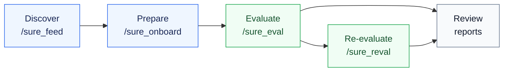

# SURE Harness

<p align="center">
  <a href="https://sure-eval.com/harness"></a>
  <a href="./docs/harness_user_guide.md"></a>
  <a href="./docs/evaluation_engine.md"></a>
  <a href="./README_ZH.md"></a>
</p>

> TUI-agent control plane for speech and audio model evaluation.

SURE Harness helps Pi/Codex-style TUI agents evaluate audio models from model
discovery to audited reports. It turns onboarding, VC/local execution, metric
routing, and prediction re-evaluation into explicit slash-command workflows.

## Why SURE Harness

| User need | Product answer |
| --- | --- |
| Agents need a route through a complex evaluation repo. | Slash commands expose bounded, artifact-gated workflows. |
| Evaluation results must be reproducible and reviewable. | Every run writes reports, manifests, route plans, and validation payloads. |
| Metric routes evolve outside the harness. | The harness reads the `sure-evaluation` submodule at runtime. |
| Existing predictions should be reusable. | `/sure_reval` recomputes metrics without rerunning model inference. |

## Workflow



## What You Can Do

| Block | Command | Prepare | Expect |
| --- | --- | --- | --- |
| Model discovery | `/sure_feed` | Model URL, provider query, or curated source. | `model_input.yaml` and discovery report. |
| Model preparation | `/sure_onboard` | Feed handoff or explicit `model_input_path`. | Runnable wrapper, model spec, fixture, and `verdict.json`. |
| Full evaluation | `/sure_eval` | Onboarded model, dataset, metric, execution target. | Predictions, validation payload, route plan, metric reports. |
| Prediction re-evaluation | `/sure_reval` | Existing `results_dir`, run dir, or `predictions/`. | Fresh evaluation-only run and `reval_run_report.json`. |
| Route-backed metrics | `sure-evaluation` | Engine submodule plus benchmark JSONL files. | Current metric capabilities, exact `pipeline_id` execution. |

## Quick Start

```bash
git clone --recurse-submodules --depth 1 --single-branch --branch harness-tui-agent https://github.com/PigeonDan1/sure.git sure-harness
cd sure-harness
npm install --ignore-scripts
```

If the repository was cloned without submodules:

```bash
git submodule update --init --recursive
```

Prepare benchmark data:

```bash
mkdir -p data/datasets/sure_benchmark
ln -s /path/to/sure_benchmark/jsonl data/datasets/sure_benchmark/jsonl
npm run sure:doctor
```

Start the TUI:

```bash
./pi-test.sh --provider openai --model <model-name> --thinking high --approve
```

Run the main path:

```text
/sure_init
/sure_feed source=modelscope query="english asr" max_models=20
/sure_onboard model=<model>
/sure_eval model=<model_name> datasets=<dataset_name> metrics=wer max_samples=5 execution=vc
```

Recompute metrics from existing predictions:

```text
/sure_reval source=<results_or_run_dir> datasets=<dataset_name> max_samples=5 pipeline_id=<exact_pipeline_id>
```

Use `execution=local` for local development. Use `execution=vc` only when the
run should produce real VC submission evidence.

## Inputs And Outputs

| Stage | Primary input | Main output | Ready signal |
| --- | --- | --- | --- |
| Discover | Model URL or query. | `sure/handoffs/<model>/model_input.yaml` | Task evidence and IO contract are present. |
| Prepare | `model=<handoff>` or `model_input_path=...` | `sure/models/<model>/verdict.json` | Import/load/infer/contract checks pass. |
| Evaluate | Model, datasets, metrics, execution target. | `main_agent_run_report.json` plus metric artifacts. | Predictions validate and route reports exist. |
| Re-evaluate | Previous results or predictions. | `reval_run_report.json` in a fresh tmp run. | `evaluation_only=true`; old metric artifacts are not reused. |

## Docs

| Need | Read |
| --- | --- |
| From zero to first run, command fields, output contracts. | [User guide](./docs/harness_user_guide.md) |
| Metric engine setup, datasets, route and `pipeline_id` selection. | [Evaluation engine](./docs/evaluation_engine.md) |
| Common setup, provider, dataset, and VC failures. | [Troubleshooting](./docs/troubleshooting.md) |
| Skill package layout, development checks, design boundaries. | [Development guide](./docs/development.md) |
| Chinese documentation. | [README_ZH](./README_ZH.md), [用户指南](./docs/harness_user_guide_zh.md) |
| Product demo. | [sure-eval.com/harness](https://sure-eval.com/harness) |

## Repository Hygiene

| Keep in repo | Keep out of repo |
| --- | --- |
| Harness code, skill packages, schemas, prompts. | API keys, provider tokens, auth files. |
| Small fixtures and tests. | Model weights, checkpoints, large datasets. |
| Documentation and examples. | Predictions, metric result dumps, `.sure/` runs, virtual environments. |

Expected local output paths such as `.sure/`, `sure/models/`,
`sure/handoffs/*/artifacts/`, and `sure/skills/sure_eval/results/` are ignored.
`sure/external/sure-evaluation` is tracked as a submodule gitlink, so the parent
repository records the verified engine commit without committing engine files.

## License

[MIT](./LICENSE)
