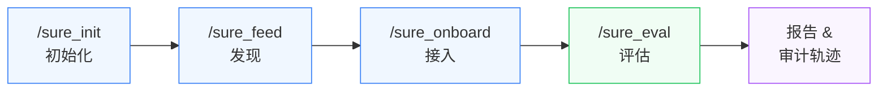
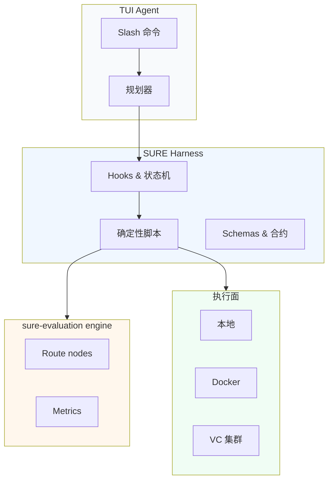

# SURE Harness

[English](./README.md) · [中文](./README_ZH.md) · [License](./LICENSE)

> 将音频模型评估转变为 agent 可读、artifact 可审计、执行过程可约束的工作流。

SURE Harness 是 Pi/Codex 风格 TUI agent 的控制平面，负责发现音频模型、完成接入、
运行有界验证、提交真实评估任务，并留下可审计的执行轨迹。

人类通过 slash command 表达意图；agent 负责规划与执行；harness 保证每次运行都可复现、
可检查、可安全回顾。

---

## 一眼看懂



## 产品工作流

| Command | 阶段 | 作用 | 主要产物 |
| --- | --- | --- | --- |
| `/sure_init` | 初始化 | 一次性项目配置：agent/provider、auth 位置、skill 发现、后端检查。 | 项目配置 |
| `/sure_feed` | 发现 | 从 ModelScope、HuggingFace、GitHub 或显式输入中发现模型，并归类到 SURE 任务族。 | `model_input.yaml`, `feed_report.json` |
| `/sure_onboard` | 接入 | 将模型仓库转变为可运行的本地推理单元，包含 wrapper、环境计划、fixture、package gate 和 verdict。 | `verdict.json`, wrapper 文件, model spec |
| `/sure_eval` | 评估 | 对已接入音频模型执行 SURE-EVAL 评估，生成 route plan、执行面、VC/local 执行证据和指标报告。 | `main_agent_run_report.json`, route plan, metric reports |

## 架构



## 核心能力

| 能力 | 职责 |
| --- | --- |
| **任务路由** | 根据模型和数据集元信息识别 ASR、TTS、VC、KWS、S2TT、说话人相关任务、语音理解等任务族。 |
| **MODEL_INPUT 生成** | 把发现阶段的证据转成 `/sure_onboard` 可消费的 YAML。 |
| **Fixture 准备** | 为不同任务准备小规模 smoke fixture，但不把 smoke 数据冒充为 benchmark 证据。 |
| **Runtime 规划** | 选择 local、Docker 或 VC 执行面，并把决策写入 artifact。 |
| **执行门禁** | 执行 bounded smoke，阻止不合规 fallback，要求终态 artifact 齐全后才能 finish。 |
| **评估路由** | 主动读取外部 `sure-evaluation` engine，发现支持的 metric、选择 route nodes，并检查 node-local 环境。 |
| **VC 提交** | 生成可提交 entrypoint，执行真实 `vc submit`，记录资源、镜像、日志和队列修复。 |
| **Artifact manifest** | 持久化 `run.json`、`events.jsonl`、最终 manifest、metric payload、sample report 和失败诊断。 |

## 快速开始

### 1. 克隆并安装依赖

```bash
git clone --branch harness-agent-eval-product-20260720 https://github.com/PigeonDan1/sure.git sure-harness
cd sure-harness
npm install --ignore-scripts
npm run sure:doctor
```

### 2. 启动 TUI

```bash
./pi-test.sh --provider openai --model <model-name> --thinking high --approve
```

### 3. 运行工作流

```text
/sure_init
/sure_feed source=modelscope query="english asr" max_models=20
/sure_onboard model=<model>
/sure_eval model=<model_name> datasets=<dataset_name> metrics=wer max_samples=5 execution=vc
```

`/sure_onboard model=<model>` 默认读取 `sure/handoffs/<model>/model_input.yaml`。
只有 handoff 不在默认位置时，才使用 `model_input_path=...`。

一个小型 ASR smoke 路径：

```text
/sure_feed https://huggingface.co/Qwen/Qwen3-ASR-0.6B-hf
/sure_onboard model=Qwen__Qwen3-ASR-0.6B-hf device=auto package=none
/sure_eval model=Qwen__Qwen3-ASR-0.6B-hf datasets=aishell1 metrics=cer max_samples=1 execution=local device=auto
```

本地开发可显式使用 `execution=local`：

```text
/sure_eval model=<model_name> datasets=<dataset_name> metrics=wer max_samples=5 execution=local
```

> **注意：** 当请求 `execution=vc` 时，运行必须产生真实 VC 提交证据，不允许静默 fallback 到 local。

## 评估引擎

SURE Harness 从独立的 `sure-evaluation` engine 读取 metric 能力和 route nodes。该 checkout
应保持本地化，不进入本仓库 Git 历史：

```bash
mkdir -p sure/external
git clone https://github.com/PigeonDan1/sure-evaluation.git sure/external/sure-evaluation
```

也可以通过环境变量指定：

```bash
export SURE_EVALUATION_HOME=/path/to/sure-evaluation
```

`/sure_eval` 还需要 SURE benchmark JSONL 文件。可以软链到默认 harness 路径：

```bash
mkdir -p data/datasets/sure_benchmark
ln -s /path/to/sure_benchmark/jsonl data/datasets/sure_benchmark/jsonl
npm run sure:doctor
```

也可以通过环境变量指向包含 `sure_benchmark/jsonl` 的数据根目录：

```bash
export SURE_EVAL_DATASETS_ROOT=/path/to/data/datasets
```

典型评估链路：

| 任务 | 链路 |
| --- | --- |
| ASR 中文 CER | `normalization/wetext_norm -> scoring/wenet_cer` |
| TTS/VC 中文 CER | `frontend/funasr_loader_16k_mono -> transcription/paraformer_zh -> normalization/punctuation_strip_norm -> scoring/wenet_cer` |
| TTS 英文 WER | `transcription/whisper_large_v3 -> normalization/whisper_norm -> scoring/wenet_wer` |

## 仓库卫生

| 应放入仓库 | 不应放入仓库 |
| --- | --- |
| Harness 代码、skill 包、schemas、prompts | API key、provider token、auth 文件 |
| 小型 fixtures 和测试 | 模型权重、checkpoint、大数据集 |
| | 生成的 prediction、metric result dump |
| | `.sure/` run 目录 |
| | 本地 external engine checkout |
| | 模型本地虚拟环境或 cache |

运行产物应该落到 ignore 路径，例如 `.sure/`、`sure/models/`、
`sure/handoffs/*/artifacts/`、`sure/skills/sure_eval/results/`。

## 排错

### `Cannot find module 'typebox'`

SURE 的 slash commands 会一起注册，所以 `/sure_onboard` 的依赖缺失也可能在你运行
`/sure_feed` 时先暴露出来。这不是 `/sure_feed` 的模型发现逻辑失败，而是本地依赖或启动入口
没有准备好。

请在仓库根目录运行：

```bash
npm install --ignore-scripts
npm run sure:doctor
```

如果 `sure:doctor` 提示 sparse checkout 路径缺失，先补齐必要路径：

```bash
git sparse-checkout add scripts fixtures packages/coding-agent/examples
npm install --ignore-scripts
npm run sure:doctor
```

然后通过本仓库的本地入口启动 TUI：

```bash
./pi-test.sh --provider openai --model <model-name> --thinking high --approve
```

## Skill 包结构

```text
sure/skills/<skill-name>/
  sure.skill.json   # skill 清单
  SKILL.md          # agent 操作手册
  hooks/            # 状态机与门禁
  scripts/          # 确定性执行脚本
  schemas/          # artifact 合约
  references/       # 领域参考
  examples/         # 使用示例
```

## 开发检查

迭代时优先跑小范围检查：

```bash
npm run check:sure-hooks
python3 -m py_compile sure/skills/sure_eval/scripts/*.py
```

更完整检查：

```bash
npm run check
```

常用 SURE 定向测试：

```bash
cd packages/coding-agent
node ../../node_modules/vitest/dist/cli.js --run test/suite/sure-extension.test.ts
node ../../node_modules/vitest/dist/cli.js --run test/suite/sure-feed.test.ts
node ../../node_modules/vitest/dist/cli.js --run test/suite/sure-onboard-state-machine.test.ts
node ../../node_modules/vitest/dist/cli.js --run test/suite/sure-eval-state-machine.test.ts
node ../../node_modules/vitest/dist/cli.js --run test/suite/sure-eval-red-lines.test.ts
```

## 设计边界

| Harness 负责 | Skill 包负责 |
| --- | --- |
| slash command 发现、run 生命周期、状态持久化 | 领域 prompt、确定性脚本 |
| hook 执行、工具门禁、最终 manifest 校验 | 状态机、schemas、checkpoints |
| | 校验规则、修复说明 |

不要把任务专属 metric、数据集假设或 SURE 业务逻辑塞进通用 harness，除非这个规则真的对所有 skill 都成立。

## License

[MIT](./LICENSE)
