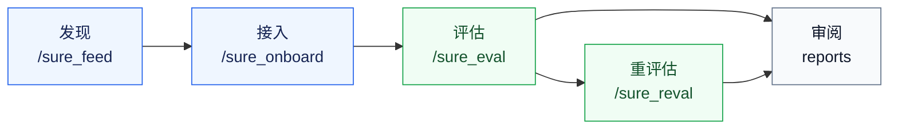

# SURE Harness

<p align="center">
  <a href="https://sure-eval.com/harness"></a>
  <a href="./docs/harness_user_guide_zh.md"></a>
  <a href="./docs/evaluation_engine_zh.md"></a>
  <a href="./README.md"></a>
</p>

> 面向语音与音频模型评测的 TUI agent 控制平面。

SURE Harness 让 Pi/Codex 风格 TUI agent 能从模型发现、接入、评估到重评估完整执行音频模型评测，并留下可审计的结果产物。它把 onboarding、VC/local 执行、metric route、prediction 重评估封装成明确的 slash-command 工作流。

## 为什么需要 SURE Harness

| 用户需求 | 产品回答 |
| --- | --- |
| Agent 需要读懂复杂评测仓库并选择执行路径。 | Slash command 暴露有边界、有 artifact 门禁的工作流。 |
| 评测结果需要可复现、可审阅。 | 每次运行都会写入 report、manifest、route plan 和 validation payload。 |
| Metric route 会在 harness 外独立演进。 | Harness 运行时读取 `sure-evaluation` submodule。 |
| 已有 predictions 应该可以复用。 | `/sure_reval` 只重新计算指标，不重新执行模型推理。 |

## 工作流



## 能做什么

| Block | Command | 需要准备 | 期望输出 |
| --- | --- | --- | --- |
| 模型发现 | `/sure_feed` | 模型 URL、provider query 或 curated source。 | `model_input.yaml` 和发现报告。 |
| 模型接入 | `/sure_onboard` | Feed handoff 或显式 `model_input_path`。 | 可运行 wrapper、model spec、fixture、`verdict.json`。 |
| 完整评估 | `/sure_eval` | 已接入模型、dataset、metric、执行面。 | Predictions、validation payload、route plan、metric reports。 |
| Prediction 重评估 | `/sure_reval` | 已完成 `results_dir`、run dir 或 `predictions/`。 | 新的 evaluation-only run 和 `reval_run_report.json`。 |
| Route-backed metrics | `sure-evaluation` | Engine submodule 和 benchmark JSONL。 | 当前 metric 能力和精确 `pipeline_id` 执行。 |

## 快速开始

先备好：Node.js >= 22.19.0、git、Python >= 3.10 并装上 PyYAML
（`pip install -r requirements.txt`）。`/sure_eval` 用的评测引擎另装一次：
`pip install -e sure/external/sure-evaluation`。

```bash
git clone --recurse-submodules --depth 1 --single-branch --branch harness-tui-agent https://github.com/PigeonDan1/sure.git sure-harness
cd sure-harness
npm install --ignore-scripts
pip install -r requirements.txt
```

如果 clone 时没有拉取 submodule：

```bash
git submodule update --init --recursive
```

准备 benchmark 数据：

```bash
mkdir -p data/datasets/sure_benchmark
ln -s /path/to/sure_benchmark/jsonl data/datasets/sure_benchmark/jsonl
npm run sure:doctor
```

启动 TUI：

```bash
./pi-test.sh --provider openai --model <model-name> --thinking high --approve
```

运行主路径：

```text
/sure_init
/sure_feed source=modelscope query="english asr" max_models=20
/sure_onboard model=<model>
/sure_eval model=<model_name> datasets=<dataset_name> metrics=wer max_samples=5 execution=vc
```

选择供应商——五个内置服务、models.json 里已配置的 OpenAI 兼容网关、或现场新建一个网关(名称、地址、API key)——然后从供应商的模型列表里选默认模型(支持在线查询的都实时拉取,Codex 这类没有列表接口的用内置目录)。

基于已有 predictions 重新计算指标：

```text
/sure_reval source=<results_or_run_dir> datasets=aishell1 max_samples=5 pipeline_id=<exact_pipeline_id>
```

当且仅当能唯一匹配到版本化 prediction 文件时，`/sure_reval` 接受 `aishell1`
这类短数据集名，例如 `aishell1__v1.0.2__asr.txt`。

本地开发使用 `execution=local`。需要真实 VC 提交证据时再使用 `execution=vc`。
使用 `execution=vc` 时可加 `vc_partition=<分区名>` 指定作业投到哪个分区,不传
则自动选择;分区名不在你的可用范围内会在输入解析阶段直接报错,并列出可用分
区。同族参数:`vc_gpu`、`vc_mem`、`vc_cpu`、`vc_image`、`vc_job_name`。

## 输入与输出

| 阶段 | 主要输入 | 主要输出 | Ready 信号 |
| --- | --- | --- | --- |
| 发现 | 模型 URL 或 query。 | `sure/handoffs/<model>/model_input.yaml` | task evidence 和 IO contract 齐全。 |
| 接入 | `model=<handoff>` 或 `model_input_path=...` | `sure/models/<model>/verdict.json` | import/load/infer/contract 检查通过。 |
| 评估 | 模型、datasets、metrics、执行面。 | `main_agent_run_report.json` 和 metric artifacts。 | predictions 校验通过，route reports 存在。 |
| 重评估 | 历史结果或 predictions。 | 新 tmp run 中的 `reval_run_report.json`。 | `evaluation_only=true`，不复用旧 metric artifacts。 |

## 标准产物

| 产物 | 由谁产出 | 证明什么 |
| --- | --- | --- |
| `runtime_inventory.json` | `/sure_onboard` | 模型级 runtime、Python/backend、weights manifest 和证据链接。 |
| `prediction_generation_status.json` | `/sure_eval` | 真实推理 server command、环境快照、显式 tool args、protocol resolution 和 dataset 生成状态。 |
| `protocol.yaml` | `/sure_eval` 和 `/sure_reval` | 只记录推理协议：模型、runtime、参数、prediction reuse、provenance。 |
| `report_snapshot.md` | `/sure_eval` 和 `/sure_reval` | 面向人类阅读的评估范围、route、metric 和结果快照。 |
| `report.jsonl` | `/sure_eval` 和 `/sure_reval` | 机器可读的 per dataset-metric 结果。 |
| `source_inference_provenance.json` | `/sure_reval` | 复用 predictions 时的源 protocol/status/runtime 链接。 |

## 运行护栏

| 范围 | 行为 |
| --- | --- |
| 重评估数据集名 | `/sure_reval` 在唯一匹配时接受和 `/sure_eval` 一致的短数据集别名。 |
| Agent 修复循环 | Hook 诊断会汇总类型错误、从 retry ledger 计算 `gate_blocks`，并显示真实阻塞原因。 |
| 本地验证 | `npm run check` 不改写源码；需要 Biome 自动格式化时使用 `npm run format`。 |
| 无密钥测试 | `test.sh`、`pi-test.sh --no-env` 和 `pi-test.ps1 --no-env` 读取 `scripts/credential-env.txt`，并临时隐藏 `auth.json`、退出时恢复。只在这里添加变量名，不写 secret value。 |

## 文档

| 需求 | 阅读 |
| --- | --- |
| 从 0 到 1、命令字段、输出契约。 | [用户指南](./docs/harness_user_guide_zh.md) |
| 指标引擎、数据集、route 与 `pipeline_id` 选择。 | [评估引擎](./docs/evaluation_engine_zh.md) |
| 常见安装、provider、数据集、VC 问题。 | [排错指南](./docs/troubleshooting_zh.md) |
| Skill 包结构、开发检查、设计边界。 | [开发指南](./docs/development_zh.md) |
| 英文文档。 | [README](./README.md), [User guide](./docs/harness_user_guide.md) |
| 产品演示。 | [sure-eval.com/harness](https://sure-eval.com/harness) |

## 仓库卫生

| 应放入仓库 | 不应放入仓库 |
| --- | --- |
| Harness 代码、skill 包、schemas、prompts。 | API key、provider token、auth 文件。 |
| 小型 fixtures 和测试。 | 模型权重、checkpoint、大数据集。 |
| 文档和示例。 | Predictions、metric result dumps、`.sure/` runs、虚拟环境。 |

`.sure/`、`sure/models/`、`sure/handoffs/*/artifacts/`、
`sure/skills/sure_eval/results/` 等本地产物路径应保持 ignored。
`sure/external/sure-evaluation` 作为 submodule gitlink 被跟踪，父仓库只记录经过验证的
engine commit，不提交 engine 文件内容。

## License

[MIT](./LICENSE)
