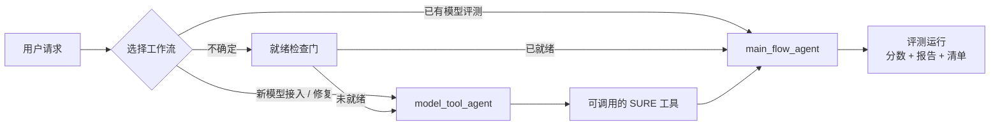

<div align="center">

# 🔊 SURE-EVAL

**面向音频处理的系统化统一鲁棒评估框架**

**S**ystematic **U**nified **R**obust **E**valuation Framework for Audio Processing

[](./README_ZH.md)
[](./README.md)
[](./docs/SURE-EVAL_User_Manual.md)
[](./docs/SURE-EVAL_User_Manual.html)
[](./docs/SURE-EVAL_User_Manual.pdf)
[](https://www.python.org/downloads/)
[](https://opensource.org/licenses/MIT)

</div>

---

## 📖 用户手册（必读）

> 如果你是第一次使用 SURE-EVAL，建议先阅读完整的用户手册：
>
> - **[📄 Markdown 版用户手册](./docs/SURE-EVAL_User_Manual.md)**（推荐在仓库内阅读）
> - **[🌐 HTML 版用户手册](./docs/SURE-EVAL_User_Manual.html)**（适合浏览器阅读）
> - **[📥 PDF 版用户手册](./docs/SURE-EVAL_User_Manual.pdf)**（适合打印和离线阅读）
>
> 用户手册以 **Qwen3-ASR** 为参考示例，系统讲解环境安装、数据准备、模型接入、评估执行和 Agent Flow。

---

## 📋 概述

SURE-EVAL 是一个面向音频工具和模型的**自动化评测框架**，核心设计原则非常简单：

> **🎯 Agent 决定范围，脚本强制执行。**

**适用人群**：希望获得可复现、可审计的基准评测结果，而不想为每个模型重新手搓流水线的音频机器学习研究者与工程师。

### 三层架构



| 层级 | 角色 | 关键文档 |
|------|------|----------|
| 🤖 **主流程 Agent** | 决定该运行什么 | [`docs/agents/main_flow_agent/README.md`](docs/agents/main_flow_agent/README.md) |
| 🔧 **模型工具 Agent** | 让模型以可复现的方式可被调用 | [`docs/agents/model_tool_agent/README.md`](docs/agents/model_tool_agent/README.md) |
| 📜 **确定性脚本层** | 准备数据、验证、打分、记录 | [`scripts/`](scripts/) |

---

## ✨ SURE-EVAL 解决了什么问题

| 目标 | 方式 |
|------|------|
| **🚀 接入新的音频模型** | 将原始仓库转化为稳定的本地工具 |
| **📊 运行受控评测** | 选择数据集 → 生成预测 → 验证 → 打分 → 记录 |

> 💡 **关键洞察**：模型集成是高不确定性的，但评测执行应该是低不确定性的。SURE-EVAL 将二者解耦。

---

## 🏗️ 架构

### 🤖 1. 主流程 Agent（Main Flow Agent）

**角色**：编排层

**职责**：
- 理解用户目标
- 任务分类
- 工具就绪性验证
- 数据集范围选择
- 脚本路由
- 结果评估

📖 **文档**：
- [Agent README](docs/agents/main_flow_agent/README.md)
- [Agent 路由指南](docs/agents/main_flow_agent/AGENTS.md)
- [工作流图库](docs/agents/workflow_gallery.md)

---

### 🔧 2. 模型工具 Agent（Model Tool Agent）

**位置**：[`docs/agents/model_tool_agent/`](docs/agents/model_tool_agent/)

**职责**：
- 后端选择
- 环境隔离
- Import / Load / Infer / Contract 验证
- Wrapper 生成
- 产物管理

📖 **文档**：
- [模型工具 Agent README](docs/agents/model_tool_agent/README.md)
- [模型工具 Agent 指南](docs/agents/model_tool_agent/AGENTS.md)
- [工作流图库](docs/agents/workflow_gallery.md)

---

### 📜 3. 确定性脚本层

**核心脚本**：

| 脚本 | 用途 |
|------|------|
| `prepare_sure_dataset.py` | 规范化数据集准备 |
| `materialize_predictions_template.py` | 预测模板生成 |
| `validate_prediction_files.py` | 预测文件验证 |
| `evaluate_predictions.py` | 指标与 RPS 计算 |
| `refresh_report_snapshot.py` | 结果记录与报告 |

---

## 🚀 快速开始指南

### 📍 我该用哪条路径？

```
从这里开始
    ↓
┌────────────────────────────────────────────────────────────┐
│ 在 src/sure_eval/models/<model> 下是否已有模型目录？      │
└────────────────────────────────────────────────────────────┘
    │
    ├── ❌ 没有 → 使用模型工具 Agent
    │         → 先构建模型本地 server
    │         → 再使用主流程 Agent
    │
    └── ✅ 有 → 检查 config.yaml 中是否有 server/tool 路径
                │
                ├── ❌ 没有 server 路径
                │   → 使用模型工具 Agent
                │
                └── ✅ 有 server 路径
                    → 运行 TOOL_READINESS_AND_ROUTING_UNIT
                        │
                        ├── 🟢 server_ready
                        │   → 继续评测
                        │
                        ├── 🟡 server_declared_but_unverified
                        │   → 先运行冒烟测试
                        │
                        └── 🔴 tool_broken_needs_repair
                            → 转交给模型工具 Agent
```

---

### 🛠️ 路径 A：接入新模型

**适用场景**：模型尚未在 `src/sure_eval/models/` 中

**步骤**：
1. 阅读 [模型工具 Agent README](docs/agents/model_tool_agent/README.md)
2. 使用模型工具 Agent 的 prompt 模板
3. 让工作流产出可调用的模型
4. 切换到主流程 Agent 进行评测

---

### 🎯 路径 B：评测已有模型

**适用场景**：模型目录已存在于 `src/sure_eval/models/`

**步骤**：
1. 从 [Agent README](docs/agents/main_flow_agent/README.md) 获取 prompt 模板
2. 让 Agent 依次执行：
   - `TASK_CLASSIFICATION_UNIT`
   - `TOOL_READINESS_AND_ROUTING_UNIT`
   - `PLAN_UNIT`
   - `DATASET_SCOPE_UNIT`
   - `SCRIPT_ROUTING_UNIT`
   - `EXECUTION_SURFACE_UNIT`
   - `EXECUTION_READINESS_UNIT`
   - `SMOKE_TEST_UNIT`
3. 继续预测生成与打分

推荐产物根目录：

- `src/sure_eval/models/<model>/eval_runs/<run_id>/`

布局契约：

- [docs/agents/main_flow_agent/contracts/eval_run_layout.md](docs/agents/main_flow_agent/contracts/eval_run_layout.md)

---

## ⚡ 安装

### 前置条件

- **Python**：主环境 3.10+；部分模型需要 3.11
- **系统包**：`ffmpeg`、`libsndfile1`（用于音频 I/O）
- **存储**：至少 20 GB，用于模型权重和数据集
- **GPU**：推荐但非必需；Qwen3-ASR 可在 CPU 上运行，但较慢
- **网络**：国内集群建议访问 ModelScope；HuggingFace 通常被屏蔽

### 使用 `uv` 快速安装

```bash
# 克隆仓库
git clone https://github.com/PigeonDan1/sure.git
cd sure

# 创建并激活主环境（推荐 Python 3.12）
uv venv --python 3.12
source .venv/bin/activate

# 安装框架
uv pip install -e .

# 验证
python -m sure_eval.models.registry
```

每个模型还有自己独立的虚拟环境，位于 `src/sure_eval/models/<model>/.venv/`。详见各模型的 `setup.sh`。

> 💡 **提示**：Agent README 中的 minimal prompt 是面向中文 Agent runtime 的复制模板。如果你的 Agent runtime 更偏好英文，可将指令翻译为英文。

---

## 📊 确定性评测流水线

无需 Agent 即可执行评测（要求模型已接入，例如 `asr_qwen3`）：

```bash
# 1️⃣ 准备数据集
python scripts/prepare_sure_dataset.py \
  --dataset aishell1

# 2️⃣ 通过模型 MCP Server 生成预测
python scripts/generate_predictions_via_server.py \
  --model-dir src/sure_eval/models/asr_qwen3 \
  --dataset aishell1 \
  --run-dir /tmp/eval_run \
  --tool-name asr_transcribe \
  --language auto \
  --resume

# 3️⃣ 验证预测文件
python scripts/validate_prediction_files.py \
  --dataset aishell1 \
  --pred-dir /tmp/eval_run/predictions \
  --require-nonempty

# 4️⃣ 评测并记录
python scripts/evaluate_predictions.py \
  --dataset aishell1 \
  --pred-dir /tmp/eval_run/predictions \
  --tool-name asr_qwen3 \
  --record \
  --output /tmp/eval_payload.json

# 5️⃣ 刷新报告快照
python scripts/refresh_report_snapshot.py \
  --markdown reports/asr_qwen3.md \
  --json reports/asr_qwen3_summary.json
```

---

## 🔄 主流程执行

### 流程图

```
TASK_CLASSIFICATION_UNIT
        ↓
TOOL_READINESS_AND_ROUTING_UNIT
        ↓
      PLAN_UNIT
        ↓
   DATASET_SCOPE_UNIT
        ↓
   SCRIPT_ROUTING_UNIT
        ↓
EXECUTION_SURFACE_UNIT
        ↓
EXECUTION_READINESS_UNIT
        ↓
   EXECUTE / WAIT
        ↓
   ASSESSMENT_UNIT
        ↓
   RUN_REPORT_UNIT
```

> ⚠️ **关键规则**：绝不要跳过工具就绪性路由！

如果模型声明了 server 路径：
1. 优先进行 server-first 冒烟测试
2. 确认 `server_ready` 状态
3. 然后才继续评测

### 两阶段规则

> 🚦 **先接入，后评测。**
>
> SURE-EVAL 将**模型接入**和**评测**视为两个不同阶段：
> 1. **第一阶段 — 模型工具 Agent**：将原始模型转化为可调用的 SURE 工具。
> 2. **第二阶段 — 主流程 Agent**：在该工具上运行基准评测。
>
> 如果主流程看到 `not_tool_ready` 或 `tool_broken_needs_repair`，应停止评测路由并转交给模型工具 Agent，不要在评测阶段临时修补。
>
> 对于新模型，尽早提供接入导向的信息：上游仓库、权重来源、预期任务/IO 契约、环境提示。

📖 **示例**：[Qwen3 ASR 案例研究](docs/agents/main_flow_agent/contracts/main_agent_qwen3_asr_case.md)

预测生成应遵循硬契约，而不是隐式的“等待文件出现”：

- [docs/agents/main_flow_agent/contracts/prediction_generation_contract.md](docs/agents/main_flow_agent/contracts/prediction_generation_contract.md)

对于人工操作的背景运行，优先使用单模型单数据集 shell：

- [docs/agents/main_flow_agent/contracts/single_model_single_dataset_shell.md](docs/agents/main_flow_agent/contracts/single_model_single_dataset_shell.md)

在将该 shell 交给用户之前，主流程应先物化执行面，再运行有界的执行就绪性验证：

- [docs/agents/main_flow_agent/contracts/main_agent_execution_surface_unit.md](docs/agents/main_flow_agent/contracts/main_agent_execution_surface_unit.md)
- [docs/agents/main_flow_agent/contracts/main_agent_execution_readiness_unit.md](docs/agents/main_flow_agent/contracts/main_agent_execution_readiness_unit.md)

---

## 📝 示例：使用主流程 Agent 进行评测

使用 [Agent README](docs/agents/main_flow_agent/README.md) 中的 prompt 模板，然后提供：

```yaml
MAIN_FLOW_INPUT:
  user_goal: evaluate_existing_model

  target:
    model_name: asr_qwen3
    model_dir: src/sure_eval/models/asr_qwen3
    tool_workflow_ready: true

  constraints:
    allow_tool_workflow: true
    allowed_tasks: [ASR]
    allowed_datasets: null
    blocked_datasets: []
    dry_run: false

  evidence:
    readme_path: src/sure_eval/models/asr_qwen3/README.md
    config_path: src/sure_eval/models/asr_qwen3/config.yaml
    artifacts_dir: src/sure_eval/models/asr_qwen3/artifacts
    model_spec_path: src/sure_eval/models/asr_qwen3/model.spec.yaml

  runtime_context:
    available_scripts:
      - scripts/prepare_sure_dataset.py
      - scripts/materialize_predictions_template.py
      - scripts/validate_prediction_files.py
      - scripts/evaluate_predictions.py
    output_dir: src/sure_eval/models/asr_qwen3/eval_runs/main_agent_asr_qwen3_001
```

### 结构化输出

- `task_classification.json`
- `tool_readiness_routing.json`
- `main_agent_plan.json`
- `dataset_decision.json`
- `script_routing.json`
- `execution_surface.json`
- `execution_readiness_report.json`
- `assessment_report.json`
- `main_agent_run_report.json`
- `model_eval_manifest.json`

---

## 📁 项目结构

```
sure-eval/
├── src/sure_eval/
│   ├── core/               # ⚙️ 核心工具
│   ├── datasets/           # 📂 数据集管理
│   ├── evaluation/         # 📊 指标与 RPS
│   ├── models/             # 🔧 模型注册表与已接入模型
│   └── reports/            # 📈 报告与基线
├── scripts/                # 📜 确定性评测脚本
├── config/                 # ⚙️ 配置文件
├── fixtures/tasks/         # 🧪 按任务划分的共享冒烟 fixture
└── docs/agents/            # 📚 Agent 级 harness 文档与模板
    ├── main_flow_agent/
    └── model_tool_agent/
```

---

## 🎯 支持的任务

| 任务 | 说明 |
|------|------|
| **ASR** | 自动语音识别 |
| **S2TT** | 语音到文本翻译 |
| **SD** | 说话人分割 |
| **SA-ASR** | 说话人感知 ASR |
| **SER** | 语音情感识别 |
| **Speech Enhancement** | 语音增强、降噪 |
| **Music IR** | 音乐信息检索 |

---

## ❓ 常见问题

**Q：`server_declared_but_unverified` 和 `tool_broken_needs_repair` 是什么意思？**

| 状态 | 含义 | 下一步 |
|---|---|---|
| `server_ready` | 模型 server 通过冒烟测试 | 继续评测 |
| `server_declared_but_unverified` | `config.yaml` 声明了 server，但尚未冒烟测试 | 手动运行 `scripts/generate_predictions_via_server.py --max-samples 1` |
| `not_tool_ready` | 模型目录缺少必要文件 | 从 [模型工具 Agent](docs/agents/model_tool_agent/README.md) 开始 |
| `tool_broken_needs_repair` | 环境或 wrapper 损坏 | 转交给模型工具 Agent，不要继续评测 |

**Q：评测产物存在哪里？**

每次运行将结构化输出写入 `src/sure_eval/models/<model>/eval_runs/<run_id>/`。详见 [评测运行布局契约](docs/agents/main_flow_agent/contracts/eval_run_layout.md)。

**Q：可以不用 Agent 运行评测吗？**

可以。使用 [📊 确定性评测流水线](#-确定性评测流水线) 中展示的脚本流水线。

---

## 📚 文档地图

| 文档 | 用途 |
|----------|---------|
| [用户手册](./docs/SURE-EVAL_User_Manual.md) | 面向中文用户的完整使用手册（另有 [HTML](./docs/SURE-EVAL_User_Manual.html) / [PDF](./docs/SURE-EVAL_User_Manual.pdf) 版本） |
| [HTML 手册](./docs/SURE-EVAL_User_Manual.html) | 浏览器友好的手册版本 |
| [PDF 手册](./docs/SURE-EVAL_User_Manual.pdf) | 可打印/离线阅读版本 |
| [工作流图库](docs/agents/workflow_gallery.md) | 两个 Agent 工作流的可视化概览 |
| [主流程 Agent](docs/agents/main_flow_agent/README.md) | Agent 系统 prompt 与示例 |
| [Agent 路由](docs/agents/main_flow_agent/AGENTS.md) | 主流程路由指南 |
| [模型工具 Agent](docs/agents/model_tool_agent/README.md) | 模型集成工作流 |
| [架构](docs/agents/main_flow_agent/contracts/main_flow_architecture.md) | 系统架构细节 |
| [评测运行布局](docs/agents/main_flow_agent/contracts/eval_run_layout.md) | 每次运行的模型本地产物布局 |
| [预测生成契约](docs/agents/main_flow_agent/contracts/prediction_generation_contract.md) | `wait_for_predictions` 的硬契约 |
| [单模型单数据集 Shell](docs/agents/main_flow_agent/contracts/single_model_single_dataset_shell.md) | 面向人工操作的一键执行契约 |
| [执行就绪性单元](docs/agents/main_flow_agent/contracts/main_agent_execution_readiness_unit.md) | 背景运行前的预检 shell 验证 |
| [模型评测清单](docs/agents/main_flow_agent/contracts/model_eval_manifest.md) | 单次模型评测的一文件索引 |
| [Qwen3 案例](docs/agents/main_flow_agent/contracts/main_agent_qwen3_asr_case.md) | 真实回放案例 |

---

## 📄 许可

MIT License. 详见 [LICENSE](LICENSE)。
