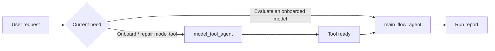

# SURE-EVAL Agent Documentation Layout

This directory is the canonical home for agent-specific harness documents.

> 🏠 **New here?** Read the [project README](../../README.md) first for the big picture, then come back to pick the right agent.

## Where to Start

| Your goal | Start here |
|-----------|------------|
| Understand the overall system | [Project README](../../README.md) |
| Evaluate an already-onboarded model | [main_flow_agent/README.md](main_flow_agent/README.md) |
| Onboard a new model or repair a broken one | [model_tool_agent/README.md](model_tool_agent/README.md) |
| See both workflows at a glance | [Workflow Gallery](workflow_gallery.md) |



```text
docs/agents/
├── main_flow_agent/
│   ├── AGENTS.md
│   ├── README.md
│   ├── contracts/
│   └── templates/
└── model_tool_agent/
    ├── AGENTS.md
    ├── README.md
    ├── contracts/
    ├── playbooks/
    ├── policies/
    ├── specs/
    ├── task_playbooks/
    └── templates/
```

## Agent Boundaries

- `main_flow_agent/` owns evaluation orchestration: task classification, tool
  readiness routing, dataset selection, script routing, execution surface
  materialization, readiness checks, assessment, and run reports.
- `model_tool_agent/` owns model onboarding: backend selection, isolated
  environment setup, weight/cache materialization, import/load/infer/contract
  validation, wrapper generation, fixture validation, and Docker validation.

All prompts and documentation should use the agent-scoped paths under
`docs/agents/`.

## Quick Comparison

| Question | Use `main_flow_agent` | Use `model_tool_agent` |
|----------|------------------------|-------------------------|
| Is the model already callable? | Yes | No or unknown |
| Main job | Evaluate and report | Onboard or repair |
| Owns datasets? | Yes | No |
| Owns wrappers and environment? | No | Yes |
| Typical output | `eval_runs/<run_id>/` | model-local wrapper, spec, artifacts |
