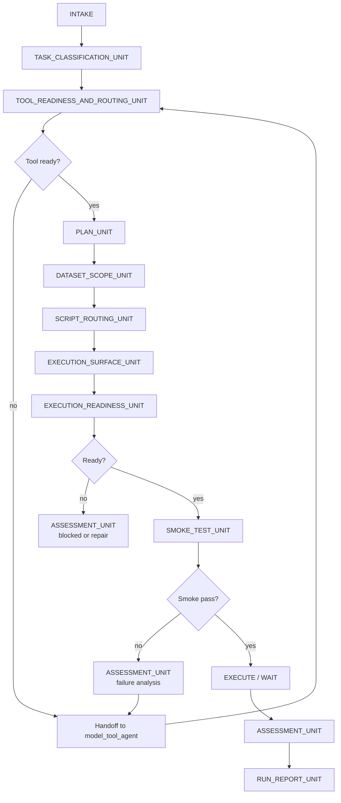

# SURE-EVAL Main Flow Agent

This is the user-facing guide for the **main-flow evaluation agent**.

Use this agent when a model is already onboarded, or when you need to decide
whether evaluation can proceed or must be handed off to the model tool-agent.

## Boundary

The main-flow agent owns evaluation orchestration:

- classify the user goal
- check tool/server readiness
- decide whether to hand off to the model tool-agent
- choose datasets and skipped-dataset reasons
- route work to deterministic scripts
- materialize `run_evaluation.sh` and `execution_surface.json`
- validate execution readiness
- run bounded smoke before full execution
- assess results and write run reports

It does **not** own model integration, dependency repair, checkpoint discovery,
wrapper design, or Docker image construction. Those belong to the
[model tool-agent](../model_tool_agent/README.md).

## Canonical Files

```text
docs/agents/main_flow_agent/
├── AGENTS.md       # authoritative harness and routing rules
├── README.md       # this user guide
├── contracts/      # unit contracts and run layout contracts
└── templates/      # main-flow structured output and shell templates
```

New prompts should cite `docs/agents/main_flow_agent/AGENTS.md`.

## When To Use

Use main-flow when:

- `src/sure_eval/models/<model>/` exists
- `config.yaml`, `server.py`, or prior onboarding artifacts may be available
- you want to evaluate, re-run, audit, or triage an existing model

Do not proceed directly to dataset evaluation if tool readiness is unknown.
The first gate is always `TOOL_READINESS_AND_ROUTING_UNIT`.

## Workflow At A Glance



This diagram is the workflow state machine. New routing documents only affect
what evidence each unit reads; they do not replace these units.

## What to Expect

A main-flow run is a conversation with an agent runtime. You provide a `MAIN_FLOW_INPUT` YAML block; the agent walks through the state machine, writes structured artifacts, and may pause at readiness gates or assessment checkpoints for confirmation.

Typical flow:
1. Classify the request.
2. Verify the model tool is ready.
3. Plan datasets and scripts.
4. Materialize `run_evaluation.sh` and `execution_surface.json`.
5. Run a bounded smoke test.
6. Execute, assess, and write the run report.

## Minimal Prompt

```text
cd /path/to/sure-eval

你现在扮演 SURE-EVAL 的主流程执行代理。你必须严格按照
docs/agents/main_flow_agent/AGENTS.md 执行一次 evaluation orchestration。

必须遵守：
1. docs/agents/main_flow_agent/AGENTS.md
2. docs/agents/main_flow_agent/contracts/main_flow_architecture.md
3. docs/agents/main_flow_agent/contracts/main_agent_spec.md
4. docs/agents/main_flow_agent/contracts/main_agent_task_unit.md
5. docs/agents/main_flow_agent/contracts/main_agent_tool_readiness_unit.md
6. docs/agents/main_flow_agent/contracts/main_agent_plan_unit.md
7. docs/agents/main_flow_agent/contracts/main_agent_dataset_unit.md
8. docs/agents/main_flow_agent/contracts/main_agent_script_routing_unit.md
9. docs/agents/main_flow_agent/contracts/main_agent_execution_surface_unit.md
10. docs/agents/main_flow_agent/contracts/main_agent_execution_readiness_unit.md
11. docs/agents/main_flow_agent/contracts/main_agent_assessment_unit.md
12. docs/agents/main_flow_agent/contracts/main_agent_run_report_unit.md

执行顺序：
INTAKE → TASK_CLASSIFICATION_UNIT → TOOL_READINESS_AND_ROUTING_UNIT
→ PLAN_UNIT → DATASET_SCOPE_UNIT → SCRIPT_ROUTING_UNIT
→ EXECUTION_SURFACE_UNIT → EXECUTION_READINESS_UNIT → SMOKE_TEST_UNIT
→ EXECUTE / WAIT → ASSESSMENT_UNIT → RUN_REPORT_UNIT

规则：
- 不允许跳过 TOOL_READINESS_AND_ROUTING_UNIT
- tool 不 ready 时 handoff 给 model tool-agent
- 能交给 deterministic scripts 的工作必须交给 scripts
- shell entrypoint 必须先 materialize，再做 readiness
- 正式执行前必须先通过 bounded smoke
- 所有 skipped dataset、handoff、blocked、stop 都必须说明理由

下面是本次输入：

MAIN_FLOW_INPUT
```

## MAIN_FLOW_INPUT

```yaml
user_goal: evaluate_existing_model  # or onboarding_then_evaluate|repair_broken_model|audit_results

target:
  model_name: asr_qwen3
  model_dir: src/sure_eval/models/asr_qwen3
  tool_workflow_ready: true
  integration_state: onboarded

constraints:
  allow_tool_workflow: true
  allowed_tasks: [ASR]
  allowed_datasets: null
  blocked_datasets: []
  dry_run: false

evidence:
  readme_path: src/sure_eval/models/asr_qwen3/README.md
  config_path: src/sure_eval/models/asr_qwen3/config.yaml
  artifacts_dir: src/sure_eval/models/asr_qwen3/artifacts
  model_spec_path: src/sure_eval/models/asr_qwen3/model.spec.yaml
  prior_results: []

runtime_context:
  available_scripts:
    - scripts/prepare_sure_dataset.py
    - scripts/materialize_predictions_template.py
    - scripts/generate_predictions_via_server.py
    - scripts/validate_prediction_files.py
    - scripts/evaluate_predictions.py
    - scripts/refresh_report_snapshot.py
  output_dir: src/sure_eval/models/asr_qwen3/eval_runs/main_agent_asr_qwen3_001
```

## Required Run Artifacts

Each main-flow run should write these files under the selected run directory:

```text
src/sure_eval/models/<model>/eval_runs/<run_id>/
├── task_classification.json
├── tool_readiness_routing.json
├── main_agent_plan.json
├── dataset_decision.json
├── script_routing.json
├── execution_surface.json
├── execution_readiness_report.json
├── assessment_report.json
├── main_agent_run_report.json
├── model_eval_manifest.json
└── run_evaluation.sh
```

Templates live in `docs/agents/main_flow_agent/templates/`.

## Execution

For local or CI runs, execute the materialized shell directly:

```bash
bash src/sure_eval/models/<model>/eval_runs/<run_id>/run_evaluation.sh
```

> 🏢 **Internal deployment note**: On AISpeech/HPC clusters with Volcano (`vc`),
> submit the run instead of running it locally:
> ```bash
> sure-eval submit-run <model_name> <run_id>
> # or
> python src/sure_eval/agent/trigger_vc.py \
>   src/sure_eval/models/<model>/eval_runs/<run_id>/execution_surface.json
> ```
> The materialized `run_evaluation.sh` remains the deterministic execution
> surface inside the container.

## Deterministic Script Surface

Main-flow evaluation should route through:

```text
scripts/prepare_sure_dataset.py
scripts/materialize_predictions_template.py
scripts/generate_predictions_via_server.py
scripts/validate_prediction_files.py
scripts/evaluate_predictions.py
scripts/refresh_report_snapshot.py
```

## See Also

- [Harness rules](AGENTS.md)
- [Architecture contract](contracts/main_flow_architecture.md)
- [Agent spec](contracts/main_agent_spec.md)
- [Run layout](contracts/eval_run_layout.md)
- [Prediction generation contract](contracts/prediction_generation_contract.md)
- [Qwen3 ASR worked case](contracts/main_agent_qwen3_asr_case.md)
