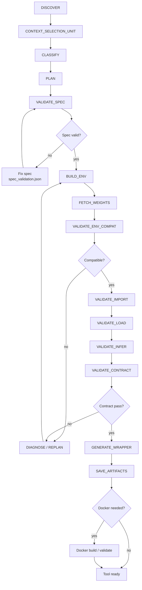
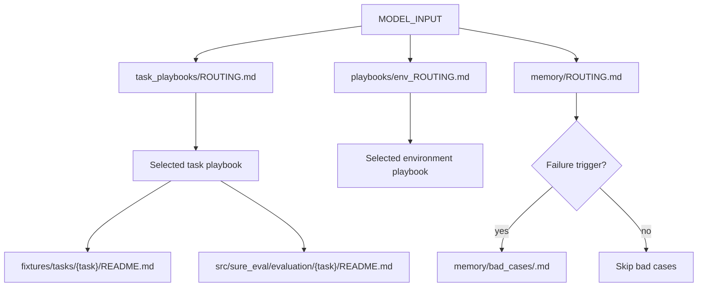

# SURE-EVAL Model Tool Agent

This is the user-facing guide for the **model onboarding / tool-agent
workflow**.

Use this agent when a raw model, API model, or partially adapted model must be
turned into a reproducible SURE local tool/server before evaluation.

## Boundary

The model tool-agent owns model integration:

- discover repository and runtime evidence
- classify model type and task type
- select backend: `uv`, `pixi/conda`, `docker`, or `api`
- validate `model.spec.yaml` before building
- build an isolated environment
- fetch or verify weights under model-local paths
- validate import, load, infer, and output contract
- generate `model.py`, `server.py`, `config.yaml`, `validate.py`, and fixtures
- save structured artifacts
- build and validate Docker images when needed

It does **not** own benchmark dataset selection, main evaluation orchestration,
result assessment, or leaderboard/report refresh. Those belong to the
[main-flow agent](../main_flow_agent/README.md).

## Canonical Files

```text
docs/agents/model_tool_agent/
├── AGENTS.md          # authoritative onboarding harness
├── README.md          # this user guide
├── contracts/         # validation and artifact contracts
├── playbooks/         # backend, preflight, failure taxonomy guides
├── policies/          # decision and safety policies
├── specs/             # model spec and wrapper contracts
├── task_playbooks/    # ASR, speech understanding, TTS, VC, KWS
├── memory/            # routed common memory and bad-case index
└── templates/         # model.spec.yaml, verdict, validate.py, manifests
```

New prompts should cite `docs/agents/model_tool_agent/AGENTS.md`.

## When To Use

Use model tool-agent when:

- the model has no usable `src/sure_eval/models/<model>/` directory
- `config.yaml` or `server.py` is missing
- import/load/infer/contract validation has not passed
- main-flow marks the target as `not_tool_ready`
- main-flow marks the target as `tool_broken_needs_repair`

If a model is already server-ready, start with the
[main-flow agent](../main_flow_agent/README.md) instead.

## Workflow At A Glance



The state machine stays stable. `CONTEXT_SELECTION_UNIT` only narrows which
task, environment, fixture, metric, and failure-memory documents are loaded.

## What to Expect

A model tool-agent run turns a raw or broken model into a callable SURE tool. You provide a `MODEL_INPUT` YAML block; the agent discovers evidence, selects backend and task playbooks, builds an isolated environment, validates import/load/infer/contract, and produces model-local artifacts.

Typical flow:
1. Discover repository and runtime evidence.
2. Classify task type and deployment target.
3. Validate `model.spec.yaml`.
4. Build an isolated environment and fetch weights.
5. Validate import → load → infer → contract.
6. Generate wrapper, server, and validation scripts.
7. Save artifacts and verdict.

## Minimal Prompt

```text
cd /path/to/sure-eval

你现在扮演 SURE-EVAL 的模型接入执行代理。你必须严格按照
docs/agents/model_tool_agent/AGENTS.md 完成一个模型的第一阶段 onboarding。

必须遵守：
1. docs/agents/model_tool_agent/AGENTS.md
2. docs/agents/model_tool_agent/memory/COMMON.md
3. docs/agents/model_tool_agent/task_playbooks/ROUTING.md
4. docs/agents/model_tool_agent/playbooks/env_ROUTING.md
5. docs/agents/model_tool_agent/policies/constitution.md
6. docs/agents/model_tool_agent/policies/evidence_priority.md
7. docs/agents/model_tool_agent/policies/backend_selection.md
8. docs/agents/model_tool_agent/policies/retry_and_escalation.md
9. docs/agents/model_tool_agent/policies/phase1_target_policy.md
10. docs/agents/model_tool_agent/contracts/spec_validation.md
11. docs/agents/model_tool_agent/contracts/minimal_validation.md
12. docs/agents/model_tool_agent/specs/wrapper_contract.md
13. docs/agents/model_tool_agent/contracts/fixture_policy.md
14. docs/agents/model_tool_agent/contracts/model_local_checkpoint_rule.md

上下文选择规则：
- 先根据 task_type 读取 task_playbooks/ROUTING.md，再读取命中的任务 playbook。
- 先根据 backend/deployment_type 读取 playbooks/env_ROUTING.md，再读取命中的环境 playbook。
- 不要默认读取所有 task_playbooks。
- 不要默认读取所有 env playbooks。
- 只有出现具体失败或风险 trigger 时，才读取 memory/ROUTING.md 和对应 bad case。
- 在 build_plan/spec_validation/tool_agent_run_report 中记录实际读取了哪些上下文。

执行顺序：
DISCOVER → CLASSIFY → PLAN → VALIDATE_SPEC → BUILD_ENV → FETCH_WEIGHTS
→ VALIDATE_IMPORT → VALIDATE_LOAD → VALIDATE_INFER → VALIDATE_CONTRACT
→ GENERATE_WRAPPER → SAVE_ARTIFACTS

规则：
- 不允许跳过 VALIDATE_SPEC
- 所有关键判断必须基于 evidence
- 所有失败必须分类
- 不允许盲重试
- 不允许无记录 patch
- 权重和 cache 默认优先落到 model-local 路径
- 最终必须输出 verdict.json 和 artifact_manifest.json

下面是本次输入：

MODEL_INPUT
```

## MODEL_INPUT

```yaml
model_id: owner/model-name
model_name: my_model
task_type: asr          # asr|s2tt|sd|ser|tts|vc|kws|...
deployment_type: local # local|api

repo:
  url: https://github.com/owner/repo
  commit: null

weights:
  source: huggingface  # huggingface|modelscope|local|api|pip|release_or_pypi
  local_path: null
  required: true
  cache_policy: model_local_first
  local_dir_name: checkpoints

environment_hint:
  preferred_backend: uv
  python_version: "3.10"
  requires_gpu: true
  system_packages: [ffmpeg, libsndfile1]

phase1_runtime_target:
  Validate the minimal callable path only:
  - import the package
  - load the model with minimal config
  - run inference on a short fixture
  This phase does not require full benchmark evaluation.

entrypoints:
  import_test: "import package"
  load_test: "model = package.load_model('tiny', 'cpu')"
  infer_test: "model.transcribe('tests/fixtures/shared/asr/en_16k.wav')"

fixture:
  audio: tests/fixtures/shared/asr/en_16k.wav
  task_specific: true
  fallback_allowed: false

io_contract:
  input_type: audio_path
  output_type: json
  primary_field: text
  required_fields: [text]
  nonempty_fields: [text]
  json_serializable: true
```

## Required Model Artifacts

Each onboarded model should produce:

```text
src/sure_eval/models/<model>/
├── model.spec.yaml
├── model.py
├── server.py
├── config.yaml
├── validate.py
├── fixture/
├── checkpoints/          # explicit local weights, when applicable
├── .runtime/             # provider cache, venv, package cache, runtime state
└── artifacts/
    ├── backend_choice.json
    ├── build_plan.json
    ├── build.log
    ├── validation.log
    ├── sample_output.json
    ├── verdict.json
    ├── artifact_manifest.json
    └── weights_manifest.json
```

Artifact purpose:

| Artifact | Purpose |
|----------|---------|
| `model.spec.yaml` | Declares task, backend, weights, entrypoints, and IO contract |
| `model.py` / `server.py` | Runtime wrapper and callable server surface |
| `validate.py` | Model-local smoke and contract validation |
| `fixture/` | Copied task fixtures used by validation |
| `artifacts/backend_choice.json` | Backend decision and evidence |
| `artifacts/spec_validation.json` | VALIDATE_SPEC result |
| `artifacts/weights_manifest.json` | Model-local weight/cache resolution |
| `artifacts/verdict.json` | Final readiness judgment |
| `artifacts/artifact_manifest.json` | Index of produced files |

Docker-capable local models should also provide:

```text
Dockerfile
Dockerfile.dockerignore
docker_build.sh
docker_validate.sh
docker_artifacts/
```

## Context Routing



The goal is purpose-specific context. Do not load every task playbook,
environment playbook, metric document, or bad case by default.

## Task Playbooks

Use routing before reading task-specific playbooks:

```text
task_playbooks/ROUTING.md
```

Then read only the selected task file:

```text
task_playbooks/ASR.md                    # ASR only
task_playbooks/SPEECH_UNDERSTANDING.md   # multi-task speech understanding
task_playbooks/TTS.md                    # TTS only
task_playbooks/VC.md                     # voice conversion only
task_playbooks/KWS.md                    # keyword spotting only
```

Do not load every task playbook by default.

## Environment Playbooks

Use routing before reading backend-specific playbooks:

```text
playbooks/env_ROUTING.md
```

Then read only the selected environment file:

```text
playbooks/env_uv.md              # uv backend
playbooks/env_pip.md             # pip backend
playbooks/env_conda.md           # conda backend
playbooks/env_pixi.md            # pixi backend
playbooks/env_docker.md          # Docker backend
playbooks/model_api.md           # API deployment
```

Read `playbooks/preflight_checklist.md` only when host capability, GPU, Docker,
registry, network, TMPDIR, or disk risk affects the decision.

## Optional Memory

Common memory:

```text
memory/COMMON.md
```

Failure-specific memory is not default context. If a concrete failure appears,
route through:

```text
memory/ROUTING.md
memory/bad_cases/README.md
```

## Templates

Reusable onboarding templates live in:

```text
templates/model.spec.yaml
templates/spec_validation.json
templates/verdict.json
templates/artifact_manifest.json
templates/validate.py
```

## Docker And Cluster Notes

> 🏢 **Internal deployment note**: The following convention is used inside the
> AISpeech/HPC environment. Public users can ignore it or substitute their own
> registry.

Local model onboarding should produce a reproducible Docker image when the model
needs local Python/system/runtime dependencies. The standard image name is:

```text
docker.v2.aispeech.com/sjtu/sjtu_yukai-dujunhao-sure_<model_name>:v1.0
```

Increment the tag for environment or script changes:

```text
v1.1, v1.2, v1.3, ...
```

Before a cluster run, verify that the image can be pulled from the registry.
Do not treat a local-only image as cluster-ready.

## See Also

- [Harness rules](AGENTS.md)
- [Spec validation](contracts/spec_validation.md)
- [Minimal validation](contracts/minimal_validation.md)
- [Wrapper contract](specs/wrapper_contract.md)
- [Fixture policy](contracts/fixture_policy.md)
- [Backend selection](policies/backend_selection.md)
- [Failure taxonomy](playbooks/failure_taxonomy.md)
- [Task playbook routing](task_playbooks/ROUTING.md)
- [Environment routing](playbooks/env_ROUTING.md)
- [Memory routing](memory/ROUTING.md)
