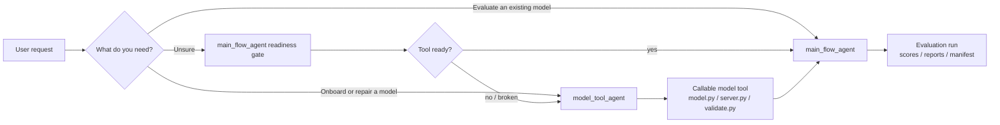
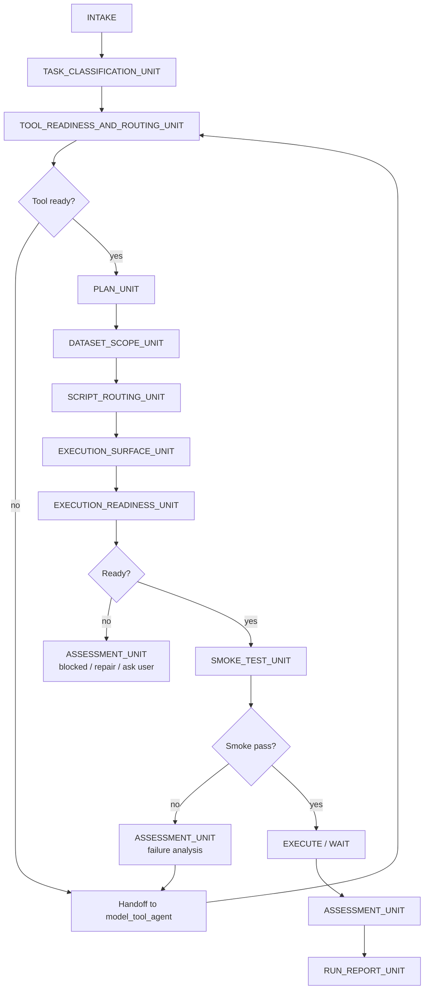
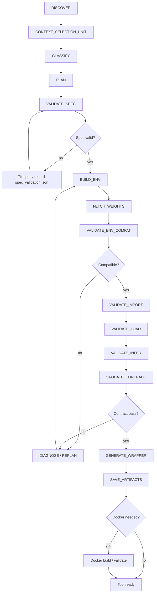
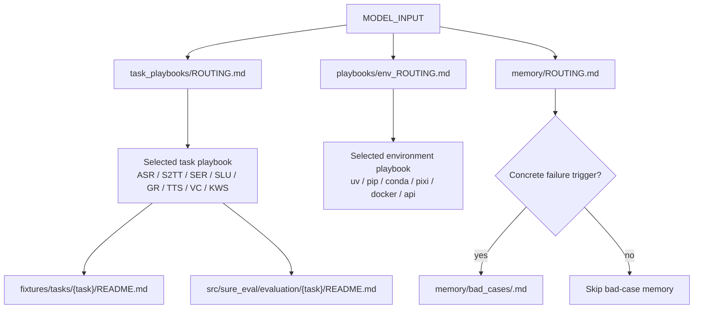
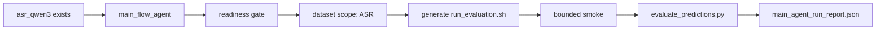
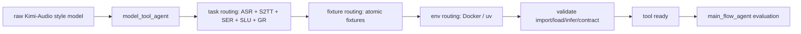
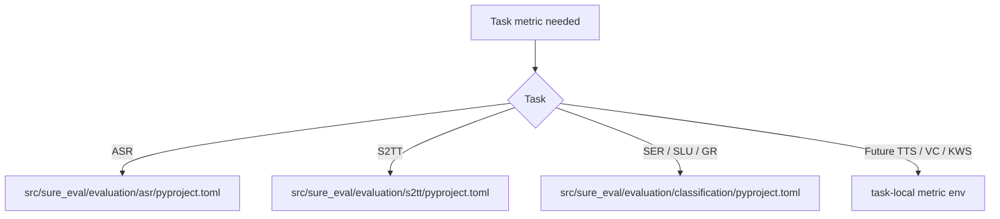

# Workflow Gallery

This gallery shows how the two SURE-EVAL agent workflows fit together. It is
for users who want the full picture before opening the detailed harness files.

## Which Workflow



Use:

- `main_flow_agent` when the model already has a usable SURE model directory.
- `model_tool_agent` when model integration, dependency repair, wrapper work, or
  Docker validation is still needed.

## Main Flow Agent State Machine



Main flow produces a model-local run directory:

```text
src/sure_eval/models/<model>/eval_runs/<run_id>/
```

## Model Tool Agent State Machine



Model tool-agent produces:

```text
src/sure_eval/models/<model>/
├── model.spec.yaml
├── model.py
├── server.py
├── config.yaml
├── validate.py
├── fixture/
└── artifacts/
```

## Context Selection Layer

The state machine stays stable. The context selection layer only decides which
documents are read for the current task, backend, fixture, metric, and failure.



## Worked Paths

### Existing ASR Model



### New Multi-Task Speech Model



### Metric Dependency Isolation



## Detailed Documents

- `docs/agents/main_flow_agent/README.md`
- `docs/agents/model_tool_agent/README.md`
- `docs/agents/main_flow_agent/AGENTS.md`
- `docs/agents/model_tool_agent/AGENTS.md`
